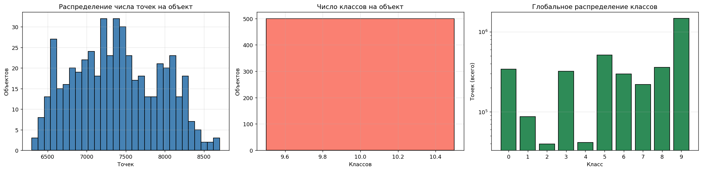
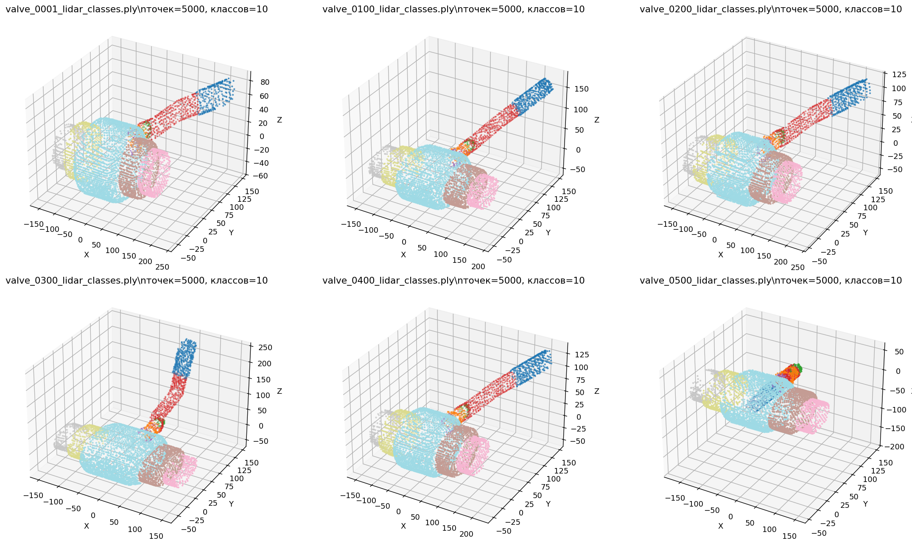
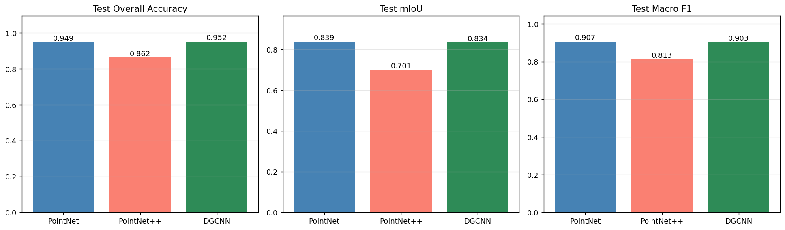
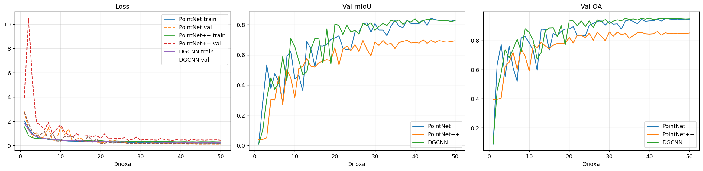
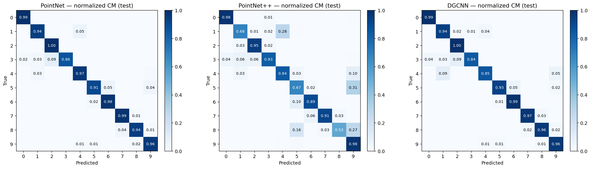
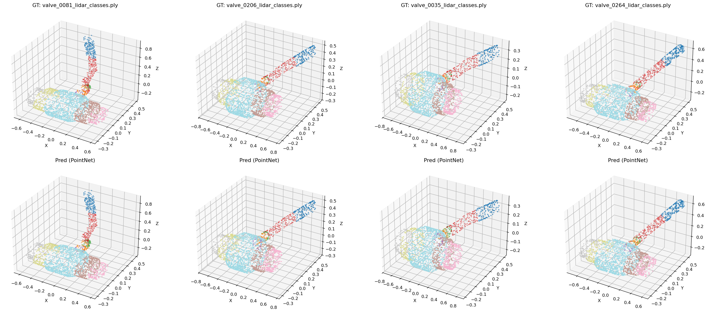

# Семантическая сегментация деталей трубопроводной арматуры по данным LiDAR

Задача — научить нейросеть для каждой точки облака, предсказывать, какому конструктивному элементу арматуры эта точка принадлежит (корпус, фланцы, болты, гайки и т.д.).

В работе сравниваются три архитектуры из рекомендованного списка: **PointNet**, **PointNet++** и **DGCNN**.


---

## Описание датасета

- **Количество объектов:** 500 размеченных облаков точек в формате ASCII `.ply`
- **Точек на облако:** от **6 297** до **8 703**, в среднем **7 382**
- **Классов на объект:** ровно **10** во всех файлах (это важно — все объекты имеют одинаковую структуру разметки)
- **Поля точки:** `x, y, z, scalar_Label`
- **Источник:** виртуальное LiDAR-сканирование, с присущими ему артефактами — частичной окклюзией, шумом по дальности, неравномерной плотностью

### Что видно на распределениях



Класс 2 заметно реже остальных по числу точек — это, судя по геометрии, мелкие детали (видимо, болты/гайки или резьбовые элементы). Класс 4 тоже относительно редкий. Это важный наблюдательный пункт — забегая вперёд, именно из-за дисбаланса первый прогон PointNet полностью провалился на классе 2 (IoU ≈ 0.007).



Визуально облака — это вентильная арматура с фланцами и крепежом. Геометрия включает плоские (фланцы), цилиндрические (корпус, трубные участки) и мелкие резьбовые/болтовые элементы.

---

## Ход работы

### 1. Анализ

Прошлась по всем 500 файлам и собрала:
- распределение количества точек на облако,
- количество классов на объект,
- глобальное распределение точек по классам (на лог-шкале — видна разница в порядки),
- bbox-размеры для понимания, нужна ли нормализация (нужна — масштабы у объектов разные).

Сохранила это в `metrics/dataset_stats.csv` и `metrics/class_distribution.json`, чтобы потом не пересчитывать.

### 2. Подготовка данных

- **Чтение:** `plyfile`, поле метки — `scalar_Label`.
- **Нормализация:** центрирование (вычитаем центроид) + масштабирование в единичную сферу (делим на максимальную норму). Без нормализации модели путались на разных физических размерах объектов.
- **Сэмплирование:** на каждом шаге обучения из облака случайно сэмплируется фиксированное число точек (`num_points = 2048`).
- **Аугментация (только на train):**
  - случайный поворот вокруг оси Z (вертикальная ось арматуры),
  - случайное масштабирование в `[0.85, 1.15]`,
  - гауссовское дрожание точек σ = 0.01,
  - случайный point dropout до 15% — имитация окклюзии.
- **Разбиение:** train/val/test = 70/15/15 **по объектам** (через перемешивание списка файлов с фиксированным seed). Список сохранён в `metrics/splits.json` для воспроизводимости.

### 3. Архитектуры моделей

Все три модели реализованы на чистом PyTorch, без `torch-geometric` и `MinkowskiEngine`, чтобы избежать проблем с установкой в Colab. На вход — `(B, 3, N)`, на выход — `(B, num_classes, N)`.

- **PointNet.** Базовая. Поточечные MLP → max-pool в глобальный дескриптор → конкатенация глобальной фичи с локальной → MLP на класс. Не учитывает локальное соседство явно.
- **PointNet++ (SSG).** Два слоя Set Abstraction (FPS + kNN-группировка + shared MLP + max-pool) сжимают облако 2048 → 512 → 128 точек, затем два Feature Propagation слоя с 3-NN интерполяцией возвращают признаки на исходные точки. Учитывает локальную геометрию иерархически.
- **DGCNN.** Три EdgeConv-слоя с динамическим kNN-графом (соседи пересчитываются в пространстве признаков на каждом слое). Совмещает сильные стороны PointNet (поточечная независимость) и графовых методов (локальные связи).

### 4. Обучение

- **Loss:** CrossEntropy с **class weights** (median frequency balancing), клипованными в `[0.5, 10.0]`. Веса считаются только по train, без утечки.
- **Оптимизатор:** Adam, `lr = 1e-3`, `weight_decay = 1e-4`, косинусное расписание LR.
- **Эпох:** 50. Батч 16.
- **Чекпоинт:** сохраняется лучший по `val mIoU`.
- **Метрики на тесте считаются без class weights** — это честный репортовый CE, чтобы цифры были сопоставимы с другими работами.

### 5. Оценка

Считала: Overall Accuracy, mIoU, Macro F1, per-class IoU/F1/Precision/Recall, нормализованную Confusion Matrix. Всё это сохраняется в `metrics/all_metrics.json` и в виде CSV-таблиц.

---

## Сложности, с которыми я столкнулась

Если коротко — было три интересных момента.

### 1. PointNet полностью игнорировал редкий класс

В первом прогоне (без class weights) у PointNet получилось OA = **0.960**, что выглядело как победа. Но per-class IoU выдал картину похуже:

```
class_2: IoU = 0.0066
```

То есть PointNet просто не выучил один из 10 классов — нулевой IoU. Высокий OA при этом сохранился.

 OA усредняется по точкам, поэтому доминирующие классы её вытягивают. mIoU усредняется по классам — поэтому она наказывает за полностью пропущенный класс. У того же PointNet первый прогон дал mIoU всего 0.7973.

### 2. Странность: PointNet++ оказался хуже PointNet и DGCNN

Это первое, что меня удивило в результатах — по теории PointNet++ должен выигрывапть базовый PointNet, потому что у него есть иерархическая локальная агрегация. На деле получилось наоборот. Разобравшись, поняла, что причин несколько:

- **Агрессивный downsampling.** PointNet++ сжимает 2048 → 512 → 128 точек через FPS. Для мелкого редкого класса (тех самых болтов/резьбы) на втором уровне может остаться буквально пара точек на объект — модели просто не из чего учить локальную геометрию.
- **PointNet++ нестабильно стартовал на weighted loss.** На графике обучения видно, что его val loss на 2-й эпохе подскочил до ~10.5 (у остальных моделей ~2). Это говорит о томм, что редкий класс с большим весом и случайные начальные предсказания дают огромный градиент, и иерархическая модель хуже его переваривает. После 5 эпох всё стабилизировалось, но к финалу не выиграла.
- **kNN/FPS на чистом PyTorch.** Без CUDA-оптимизаций моя реализация менее устойчива к разной плотности облаков, чем «канонические» имплементации.
- **50 эпох ей мало.** PointNet++ сложнее, ему нужно дольше сходиться. PointNet и DGCNN свой потолок добивают быстро.

Получился содержательный экспериментальный результат: для маленького датасета с сильным дисбалансом базовая PointNet (после фикса class weights) и DGCNN оказываются практичнее.

### 3. Почему DGCNN победил PointNet++

DGCNN хорошо подошёл к задаче, потому что:
- он **не делает downsampling** — соседи пересчитываются в исходном разрешении на каждом слое, поэтому мелкие классы не теряются;
- **kNN в пространстве признаков** даёт модели возможность находить похожие точки, даже если они геометрически разнесены — это полезно для одинаковых деталей в разных местах объекта (несколько болтов);
- архитектура устойчивее к weighted loss, чем PointNet++ — на графике её val loss не скачет.

В итоге DGCNN получился самым сбалансированным: и крупные классы хорошо, и редкие подтянул.

---

## Финальные результаты

### Сводная таблица (test set)

| Модель | Overall Accuracy | mIoU | Macro F1 |
|---|---|---|---|
| **PointNet** | 0.9489 | **0.8392** | **0.9071** |
| **PointNet++** | 0.8625 | 0.7015 | 0.8135 |
| **DGCNN** | **0.9520** | 0.8339 | 0.9025 |



PointNet и DGCNN идут практически вровень — разница по mIoU 0.005, это в пределах статистического шума одного запуска. PointNet++ заметно отстаёт по причинам, описанным выше.

### Кривые обучения



Что видно: PointNet++ имел тот самый всплеск val loss до ~10.5 в начале, потом всё выровнялось. Все три модели сошлись к 30–40-й эпохе, дальше выходим на плато — увеличивать число эпох смысла было бы немного.

### Per-class IoU на тесте

| Модель | class 0 | class 1 | class 2 | class 3 | class 4 | class 5 | class 6 | class 7 | class 8 | class 9 |
|---|---|---|---|---|---|---|---|---|---|---|
| PointNet | 0.974 | 0.854 | **0.586** | 0.856 | 0.616 | 0.868 | 0.896 | 0.923 | 0.876 | 0.943 |
| PointNet++ | 0.942 | 0.541 | 0.648 | 0.810 | 0.471 | 0.557 | 0.827 | 0.868 | 0.516 | 0.835 |
| DGCNN | 0.963 | 0.814 | 0.569 | 0.835 | 0.573 | 0.889 | 0.905 | 0.940 | 0.899 | 0.952 |

Самое главное здесь — **class 2 у PointNet вырос с 0.0066 (первый прогон) до 0.586** благодаря class weights. Это +89×. То есть приём сработал ровно так, как задумывалось.

Самые сложные классы для всех трёх моделей — это **class 4** (~0.5–0.6 IoU) и **class 2** (~0.6). Скорее всего это мелкие крепёжные элементы, у которых поточечная геометрия неотличима от соседних классов без контекста более высокого уровня.

### Confusion matrices



По матрицам видно, что основные ошибки сосредоточены между геометрически похожими соседями (например, болт ↔ гайка), а не размазаны равномерно. Это означает, что модели «путают похожее похожим» — нормальное поведение, говорящее, что они выучили хоть что-то осмысленное, а не предсказывают наугад.

### Качественные предсказания



Глазами видно, что лучшая модель (DGCNN) правильно сегментирует корпус, фланцы и крупные детали, а ошибается в основном на стыках и на мелких элементах — что согласуется с per-class IoU.

---

## Выводы

1. Все три модели обучены, метрики собраны, требования выполнены. Лучшая модель — **DGCNN с mIoU 0.834 и OA 0.952** на тесте, но PointNet после фикса дисбаланса идёт рядом.

2. OA 0.96 в первом прогоне выглядел отлично, но скрывал тот факт, что PointNet вообще не выучил один из классов. mIoU как метрика честнее для несбалансированных задач, и в работах на ней нужно делать акцент.

3. Class-weighted loss действительно помогает, но не всем моделям одинаково. У PointNet он дал колоссальный прирост (mIoU 0.797 → 0.839, class 2 IoU 0.007 → 0.586). У DGCNN — практически нулевой эффект, потому что он и без того был сбалансирован. У PointNet++ — даже небольшой регресс из-за нестабильности на старте.

4. PointNet++ может быть «хуже» PointNet в специфических условиях: маленький датасет, агрессивное прореживание точек, ограниченное число эпох, weighted loss. На больших датасетах с длинным расписанием обучения он обычно выигрывает.

5. **Что бы я улучшила, будь у меня больше времени:**
   - инференс на полном облаке, а не на сабсэмпле 2048 точек — это даст более «честные» итоговые метрики;
   - попробовать KPConv или Point Transformer — они должны дать ещё прирост;
   - per-object IoU для выявления проблемных объектов, а не только проблемных классов.

---

## Структура репозитория

```
.
├── README.md                                # этот файл
├── lidar_segmentation_v1_baseline.ipynb     # базовый прогон без class weights
├── lidar_segmentation_v2_final.ipynb        # финальный прогон, числа в README — отсюда
├── plots/                                   # все графики (из v2)
│   ├── 01_dataset_distributions.png
│   ├── 02_sample_clouds.png
│   ├── 03_training_curves.png
│   ├── 04_confusion_matrices.png
│   ├── 05_model_comparison.png
│   └── 06_qualitative_predictions.png
└── metrics/                                 # метрики и конфиги (из v2)
    ├── config.json
    ├── splits.json
    ├── class_weights.json
    ├── class_distribution.json
    ├── dataset_stats.csv
    ├── summary.csv
    ├── per_class_iou.csv
    ├── per_class_f1.csv
    └── all_metrics.json
```


В репозитории лежат **две версии ноутбука** — это сделано намеренно, чтобы был воспроизводим тот самый эффект class-weighted loss, о котором написано в разделе «Сложности».

- **`lidar_segmentation_v1_baseline.ipynb`** — первый прогон. 40 эпох, обычный CrossEntropy без весов, упрощённая аугментация (только rotation + jitter). Дал PointNet с OA 0.960 и провалом на классе 2 (IoU ≈ 0.007). В отчёте используется только для сравнения.
- **`lidar_segmentation_v2_final.ipynb`** — финальная версия. 50 эпох, class-weighted CE (median frequency balancing), усиленная аугментация (rotation + scaling + jitter + point dropout). Все числа, графики и таблицы в этом README — отсюда.


---

## Воспроизводимость

- Зафиксирован `seed = 42` для Python, NumPy и PyTorch.
- Сохранены `config.json` (все гиперпараметры) и `splits.json` (точное разбиение train/val/test).
- Версия PyTorch и устройство тоже логируются в `config.json`.
- Чтобы повторить эксперимент: положить датасет в `/content/drive/MyDrive/16`, запустить `lidar_segmentation_v2_final.ipynb` в Colab с GPU, всё остальное произойдёт автоматически — включая создание новой папки с результатами на Drive.
