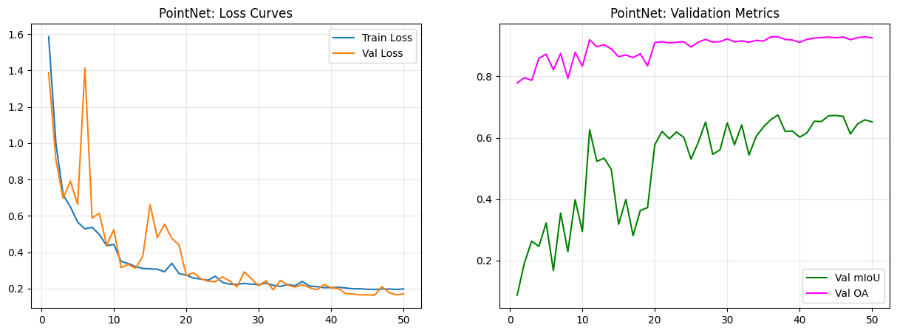
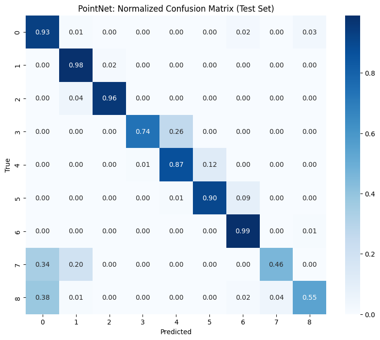
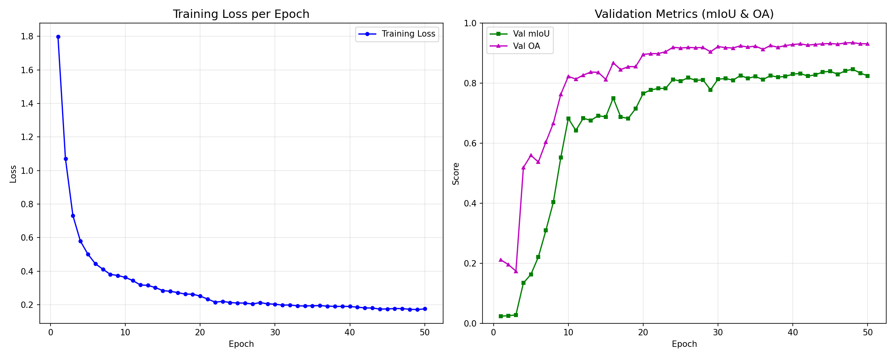
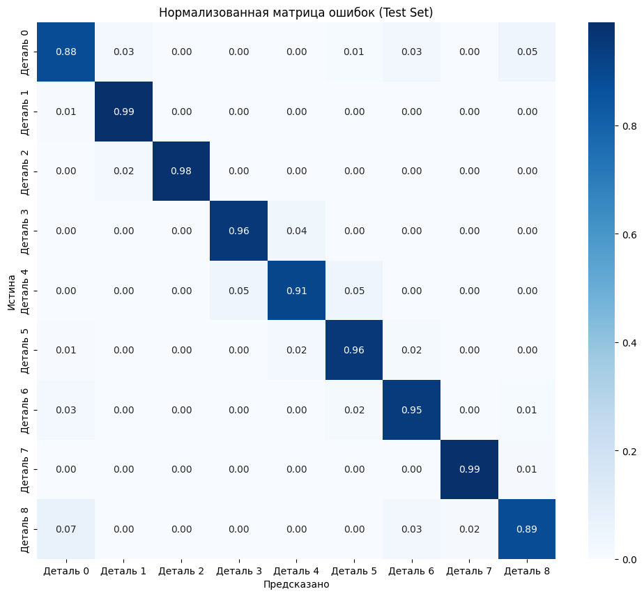
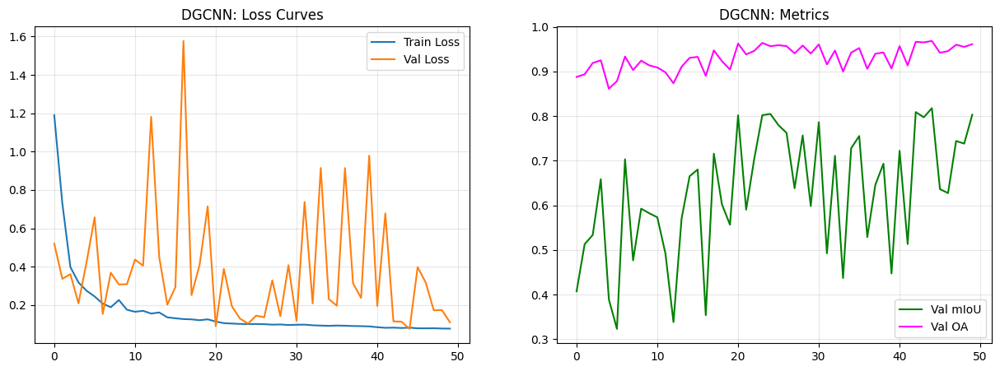
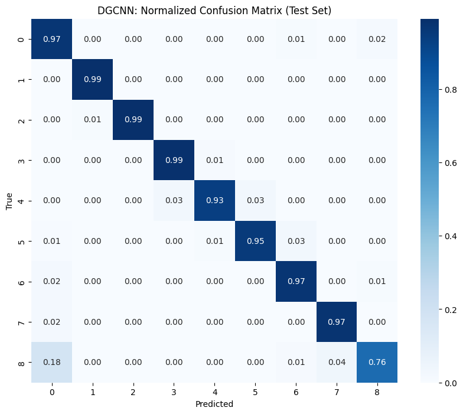

# Лабораторная работа №1: Семантическая сегментация трубопроводной арматуры по данным LiDAR

## Описание проекта
Целью данной работы является исследование и сравнение различных архитектур нейронных сетей для задачи сегментации 3D-облаков точек. В качестве объекта исследования выступает промышленная трубопроводная арматура, отсканированная методом имитации наземного лазерного сканирования.

**Задача:** Классифицировать каждую точку облака (8192 точки) по 9 конструктивным классам (корпус, фланцы, болты, патрубки и т.д.).

---

## Методология экспериментов
Для всех моделей использовались идентичные условия обучения:
- **Датасет:** 500 PLY файлов (70% Train / 15% Val / 15% Test).
- **Количество точек:** 8192 на объект.
- **Оптимизатор:** Adam (LR=0.001) с планировщиком StepLR.
- **Функция потерь:** Weighted Cross-Entropy (учитывающая дисбаланс классов).
- **Эпохи:** 50.

---

## Исследуемые архитектуры

### 1. PointNet (Baseline)
Базовая архитектура, обрабатывающая точки независимо друг от друга с последующим извлечением глобального признака.
- **Особенности:** Не учитывает локальные взаимосвязи между точками.
- **Результаты:** Показала самый низкий результат mIoU, так как «размывает» границы мелких деталей.

| График обучения | Матрица ошибок |
| :---: | :---: |
|  |  |

---

### 2. PointNet++ (Hierarchical)
Улучшенная версия PointNet, использующая иерархическую группировку точек (Set Abstraction) для извлечения локальных геометрических признаков.
- **Особенности:** Использование алгоритма Ball Query для поиска соседей в радиусе.
- **Результаты:** **Лучший показатель mIoU**. Модель наиболее точно сегментирует мелкие узлы и крепежные элементы.

| График обучения | Матрица ошибок |
| :---: | :---: |
|  |  |

---

### 3. DGCNN (Graph-based)
Динамическая графовая нейронная сеть, строящая графы ближайших соседей в признаковом пространстве (слои EdgeConv).
- **Особенности:** Динамическое обновление графа на каждом слое.
- **Результаты:** **Самая высокая общая точность (OA)**. Модель великолепно понимает общую топологию объекта.

| График обучения | Матрица ошибок |
| :---: | :---: |
|  |  |

---

## Итоговое сравнение моделей

Ниже представлена сводная таблица результатов тестирования моделей на данных, которые не участвовали в обучении:

| Модель | Overall Accuracy (OA) | Mean IoU (mIoU) | F1-Score (Macro) |
| :--- | :---: | :---: | :---: |
| **PointNet** | 0.9038 | 0.6436 | 0.7240 |
| **PointNet++** | 0.9349 | **0.8459** | 0.9150 |
| **DGCNN** | **0.9563** | 0.8174 | **0.9310** |

---

## 🔍 Выводы
1. **PointNet++** является наиболее сбалансированной моделью для сегментации сложных деталей за счет учета локальной геометрии. Она лучше всего справилась с выделением мелких элементов арматуры.
2. **DGCNN** демонстрирует лучшую обобщающую способность (высокий OA), но требует значительно больше вычислительных ресурсов (VRAM) для построения динамических графов.
3. **PointNet** может использоваться только как базовое решение (Baseline), так как отсутствие механизмов локальной группировки не позволяет достичь высокого качества сегментации на сложных промышленных объектах.

---

## 📂 Структура репозитория
- `/PointNet`: Веса модели (`.pth`), графики и матрица ошибок.
- `/PointNet++`: Веса модели (`.pth`), графики и матрица ошибок.
- `/DGCNN`: Веса модели (`.pth`), графики и матрица ошибок.