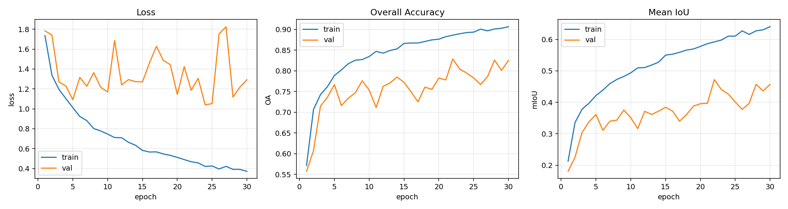
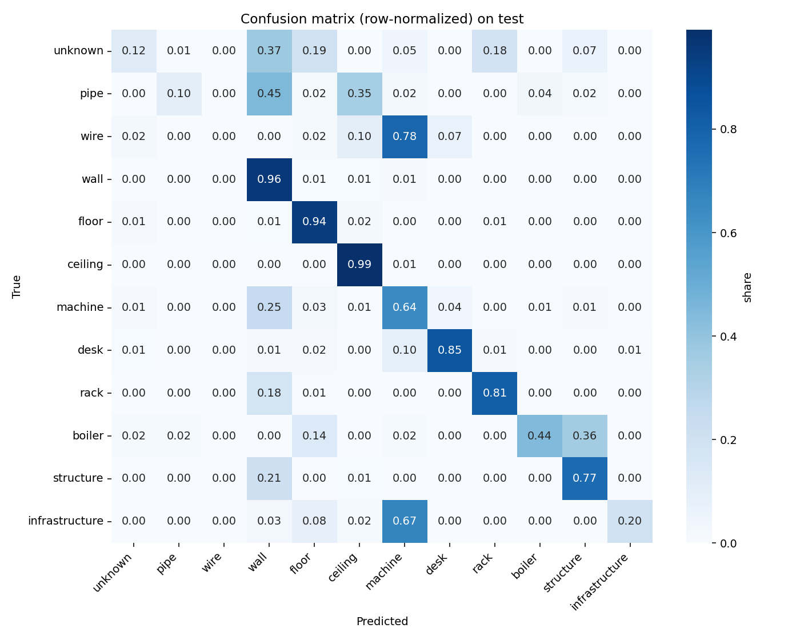
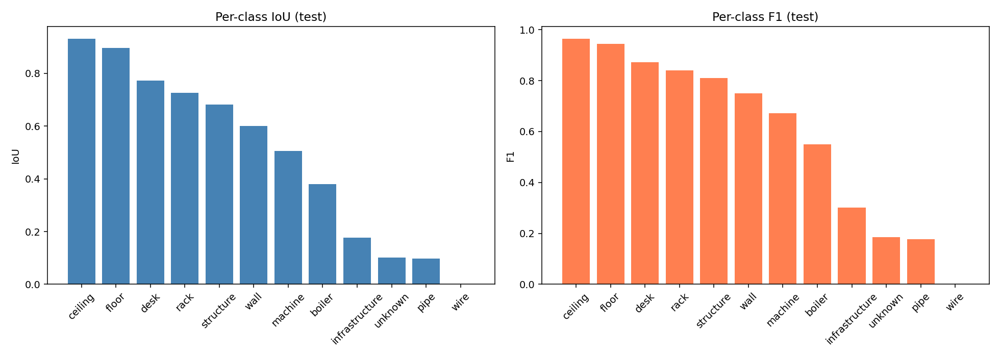

# Семантическая сегментация LiDAR облаков точек промышленной инфраструктуры

Задача — семантическая сегментация облаков точек, полученных синтетическим LiDAR-сканированием промышленных сцен.

## Постановка задачи

Согласно ТЗ требуется:
- разработать модель машинного обучения для семантической сегментации LiDAR облаков точек;
- модель должна для каждой точки облака предсказывать её семантический класс (`label`);
- допустимые архитектуры: PointNet, PointNet++, DGCNN, KPConv и др.;
- разделение датасета должно выполняться по run-папкам без утечек между train/test;
- обязательные метрики: Overall Accuracy, Macro F1, Mean IoU, Confusion Matrix.

В качестве архитектуры выбрана **PointNet++** (через PyTorch Geometric).

## Данные

Датасет состоит из синтетических LiDAR-сканов промышленных сцен. Всего **711 файлов PLY**, в каждом ~500 000 точек, суммарно ~353 млн точек.

Каждая точка содержит координаты `x, y, z`, цвет `r, g, b`, метаданные сканирования (`station_index`, `circle_index`, `elevation_deg`), идентификатор экземпляра `instance_id` и семантическую метку `label`.

Сцены и их структура:

| Сцена | Файлов | Особенность |
|---|---|---|
| boliler | 121 | котельная, доминирует `structure` и `floor` |
| control | 63 | пультовая, много `ceiling` |
| electrical | 60 | электротехническая, `ceiling` + `floor` |
| laboratory | 109 | лаборатория, `ceiling` + `machine` |
| maintenance | 33 | ремонтный цех |
| office | 111 | офис, `desk` + `ceiling` |
| refinery | 85 | нефтепереработка, доминирует `pipe` |
| storage | 129 | склад, доминирует `rack` |

Внутри каждой сцены файлы организованы по **проходам сканера** — папкам `circles1`, `circles2`, ..., `circles5`. Это важная деталь — она оказала решающее влияние на стратегию разделения данных.

## Структура репозитория

```
.
├── README.md                        — этот файл
├── notebooks/
│   ├── Lab3_final.ipynb             — финальный рабочий блокнот
│   └── Lab3_process.ipynb           — исследовательский блокнот со всеми попытками
├── configs/
│   ├── class_map.json               — все 19 классов из ТЗ
│   └── class_remap.json             — маппинг активных 12 классов и веса
├── splits/
│   └── split_v2.json                — финальный сплит train/val/test по circles
├── checkpoints/
│   └── best_model.pth               — обученные веса (PointNet++, 406k параметров)
├── logs/
│   └── train_log.json               — лог обучения по эпохам
├── results/
│   ├── eda_class_distribution.csv   — распределение классов в датасете
│   ├── scene_class_distribution.csv — распределение классов по сценам
│   ├── full_class_distribution.csv  — полное распределение по всем 711 файлам
│   ├── test_metrics.json            — финальные метрики
│   ├── per_class_metrics.csv        — IoU и F1 по классам
│   └── confusion_matrix.npy         — матрица ошибок
└── figures/
    ├── class_distribution_full.png  — распределение классов
    ├── scene_class_heatmap.png      — распределение классов по сценам
    ├── training_curves.png          — кривые обучения (loss, OA, mIoU)
    ├── confusion_matrix.png         — матрица ошибок
    └── per_class_metrics.png        — per-class IoU и F1
```

## Анализ данных

Перед обучением был проведён EDA по всем 711 файлам.

**Распределение классов (по всему датасету):**

| Класс | Точек | Доля |
|---|---|---|
| ceiling | 111M | 31.5% |
| floor | 86M | 24.3% |
| wall | 45M | 12.7% |
| structure | 25M | 7.1% |
| rack | 20M | 5.6% |
| desk | 18M | 5.0% |
| machine | 17M | 4.8% |
| pipe | 17M | 4.7% |
| unknown | 9M | 2.5% |
| boiler | 4.5M | 1.3% |
| infrastructure | 1.5M | 0.4% |
| wire | 330k | 0.09% |

**Классы**


В задании предусмотрено 19 классов, но в данных представлены только **12**. Остальные 7 (`conveyor`, `roof`, `window`, `door`, `gate`, `terrain`, `facade`) отсутствуют. Метки были перенумерованы в диапазон `[0..11]`, неиспользуемые ID отброшены.

Хорошо видна **сильная несбалансированность**: `ceiling` и `floor` вместе занимают более 55% всех точек, а самый редкий класс `wire` — всего 0.09%. Это разница в ~350 раз. Для обучения с CrossEntropyLoss были рассчитаны веса классов по формуле `1 / log(1.02 + p)`, нормированные к среднему 1.0.

## Архитектура и обучение

**Модель — упрощённая PointNet++ (SSG):**
- 3 SetAbstraction блока (ratio=0.25, радиусы 0.1 / 0.2 / 0.4 в нормализованных координатах)
- 3 FeaturePropagation блока для апсэмплинга обратно к исходному облаку
- head с Dropout 0.5
- 406 348 параметров

**Параметры обучения:**
- 24 576 точек на семпл (случайная подвыборка из 500k)
- Аугментации: случайный поворот вокруг Z, jitter, сдвиг, масштабирование
- Нормализация координат к единичной сфере
- batch_size = 2 файла
- Adam, lr = 1e-3, weight_decay = 1e-4
- CosineAnnealing LR schedule до 1e-5
- CrossEntropyLoss с весами классов
- Gradient clipping = 1.0
- 40 эпох (фактически 30 — среда упала на 31-й, см. ниже)

## История экспериментов и две главные ошибки


### Ошибка №1. Неправильный сплит данных

В ТЗ сказано: разделение должно выполняться "по run-папкам, без смешивания сцен между train/test". Изначально я интерпретировала это слишком буквально:
- train: boliler, laboratory, office, refinery, storage (555 файлов)
- val: control (63 файла)
- test: electrical, maintenance (93 файла)

Модель училась на одних сценах и тестировалась на полностью других. После 30 эпох **val mIoU = 0.20**, train loss падал с 0.77 до 0.40, а val loss наоборот рос с 1.8 до 2.6 — классический overfitting + полная неспособность обобщить на новые сцены.

Проблема в том, что сцены принципиально разные: в `refinery` доминируют трубы и `unknown`, в `office` — столы и потолок, в `storage` — стеллажи. Когда модель никогда не видела геометрию офиса, она физически не может разметить его правильно.

**Решение:** при разборе структуры данных я обратила внимание, что внутри каждой сцены есть подпапки `circles1..circles5` — это разные **проходы сканера** одной и той же сцены. Это и есть настоящие "run-папки" в терминологии ТЗ. Пересоставила сплит:
- внутри каждой сцены первые N−2 проходов → train
- предпоследний проход → val
- последний проход → test

Итого 419 / 160 / 132 файла, все сцены представлены во всех частях, но конкретные проходы сканера не пересекаются. Это реалистичный сценарий - сцена частично знакома, но сканируется с новых позиций.

После такого сплита val mIoU подскочил с 0.20 до **0.47** — рост в 2.4 раза без единого изменения архитектуры или гиперпараметров.

### Ошибка №2. Потеря результатов из-за чужой расшаренной папки

Датасет `IS` был расшарен в Google Drive из чужого аккаунта. В Colab такая папка примонтировалась как read-only — это нельзя было обойти даже после открытия прав на редактирование. При первой попытке сохранить лог обучения скрипт упал с `OSError: Read-only file system`.

Чтобы обойти, я стала писать в локальную папку `/content/local_project/` в самой виртуалке Colab. Это работало, но имело критический недостаток: при падении среды (а Colab падает регулярно — после 80 минут работы, при сетевых сбоях, при OOM) всё содержимое локальной папки **полностью уничтожается**. Первый успешный прогон с val mIoU 0.51 был потерян именно так — обучение завершилось, а файлы скачать через `files.download()` не успели, среда умерла раньше.

**Решение:** создать новую папку прямо в собственном MyDrive (а не в расшаренной чужой папке) — `IS_project_results/`. Туда можно писать. И сохранять чекпойнт после каждого улучшения val mIoU непосредственно туда. Этот подход и был использован в финальном прогоне.

Был ещё один нюанс с кэшированием. Чтение PLY с Drive занимает ~10 секунд на файл, что для 711 файлов означает ~2 часа на полный проход. Поэтому все облака были один раз сконвертированы в локальный формат `.npz` и сохранены в кэш на Drive — после этого чтение ускорилось примерно в 6 раз. На самом этапе кэширования тоже была проблема (имена файлов сохранились с двойным `.npz.tmp.npz` из-за бага в `np.savez_compressed`, и пришлось их переименовывать постфактум), но кэш в итоге собрался.

### Финальный прогон

После исправления обоих недостатков был запущен последний прогон на 40 эпох. На 30-й эпохе среда Colab снова упала, но к этому моменту лучший чекпойнт (`val mIoU = 0.4724`) уже был сохранён на Drive, и его удалось использовать для финального тестирования.

## Финальные результаты

Метрики на test-сплите (132 файла, 5-й проход каждой сцены):

| Метрика | Значение |
|---|---|
| **Overall Accuracy** | **0.8514** |
| **Mean IoU** | **0.4889** |
| **Macro F1** | **0.5889** |

Per-class IoU и F1:

| Класс | IoU | F1 |
|---|---|---|
| ceiling | 0.930 | 0.964 |
| floor | 0.896 | 0.945 |
| desk | 0.772 | 0.871 |
| rack | 0.726 | 0.841 |
| structure | 0.682 | 0.811 |
| wall | 0.601 | 0.750 |
| machine | 0.505 | 0.672 |
| boiler | 0.379 | 0.550 |
| infrastructure | 0.177 | 0.301 |
| unknown | 0.102 | 0.185 |
| pipe | 0.097 | 0.177 |
| wire | 0.000 | 0.000 |

**Кривые обучения:**



**Confusion matrix (нормализованная по строкам):**



**Per-class метрики:**



### Анализ результатов

Модель хорошо справляется с крупными частыми классами:
- `ceiling` (IoU 0.93) и `floor` (0.90) — крупные плоские поверхности, легко выделяются;
- `desk` (0.77) и `rack` (0.73) — компактные структурированные объекты;
- `structure` (0.68) и `wall` (0.60) — плоские, хотя есть путаница между ними.

Средний уровень:
- `machine` (0.51) — часто путается с `wall` (25% точек класса `machine` модель относит к `wall`, что логично — крупные машины с плоскими гранями).

Плохо распознаются редкие классы:
- `wire` (IoU 0.00) — провода полностью теряются. У них всего 0.09% точек в датасете, даже взвешенный loss не помогает;
- `pipe` (0.10) — путается с `wall` (45% точек) и `ceiling` (35%);
- `unknown` (0.10) — по определению сложный класс без чёткой геометрии;
- `infrastructure` (0.18) — 67% точек класса предсказываются как `machine`.

Это классический **дисбаланс классов**. Способы улучшения:
- focal loss вместо взвешенного cross-entropy;
- balanced sampling — намеренно подбирать в батч сэмплы с редкими классами;
- более глубокая модель с большим receptive field (трубы и провода имеют сильно вытянутую геометрию, которую плохо ловят сферические окрестности PointNet++);
- использование RGB и нормалей как дополнительных фич, а не только XYZ;
- две стадии обучения: сначала сегментация крупных классов, затем уточнение мелких.

## Выводы

1. Реализована система семантической сегментации LiDAR облаков точек на основе **PointNet++**. На тестовой выборке достигнута Overall Accuracy 0.85 и Mean IoU 0.49 на 12 классах с очень сильным дисбалансом.

2. Качество модели **ограничено классами с малой представленностью** (`wire`, `pipe`, `wire`). На частых классах (`ceiling`, `floor`, `desk`, `rack`) модель работает уверенно (IoU > 0.7).

3. Главный вывод по процессу разработки — правильный сплит данных может стоить больше, чем выбор архитектуры. Простое изменение стратегии разделения дало рост val mIoU в 2.4 раза без какого-либо изменения модели.

4. Инфраструктура Google Colab требует осторожного обращения: расшаренные папки read-only, локальное хранилище VM не выживает падения среды, поэтому критически важно сохранять чекпойнты и логи на собственный Drive после каждой успешной эпохи.

5. Дальнейшие направления улучшения: использовать focal loss и balanced sampling против дисбаланса; добавить нормали и RGB как признаки; попробовать KPConv или Point Transformer для лучшего качества на редких классах.

## Как запустить

1. Открыть `notebooks/Lab3_final.ipynb` в Google Colab.
2. Включить GPU: `Среда выполнения → Сменить тип среды выполнения → T4 GPU`.
3. Положить датасет (или ярлык на него) в `MyDrive/IS/`.
4. Положить кэш `.npz` (или создать заново) в `MyDrive/IS_project/cache_npz/`.
5. Выполнить ячейки по порядку. Результаты сохранятся в `MyDrive/IS_project_results/`.

Полное обучение занимает ~85 минут на T4 GPU.
