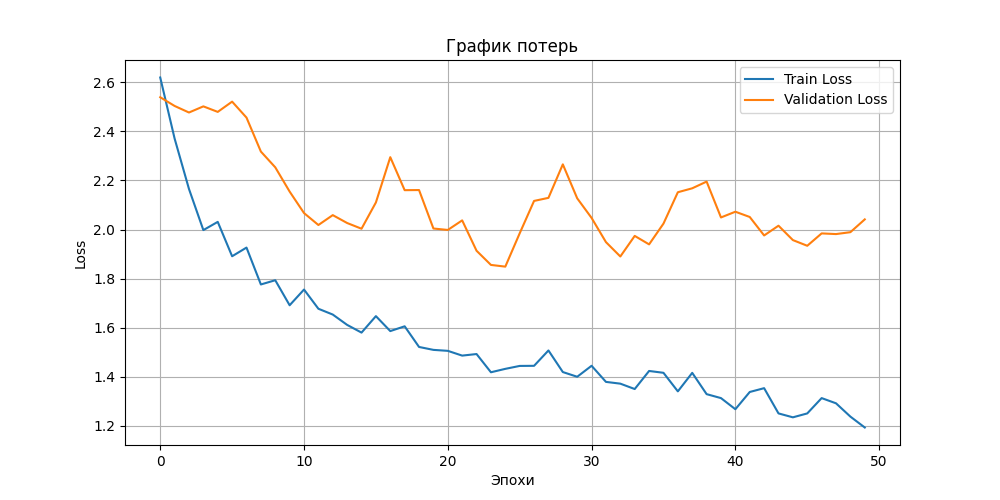
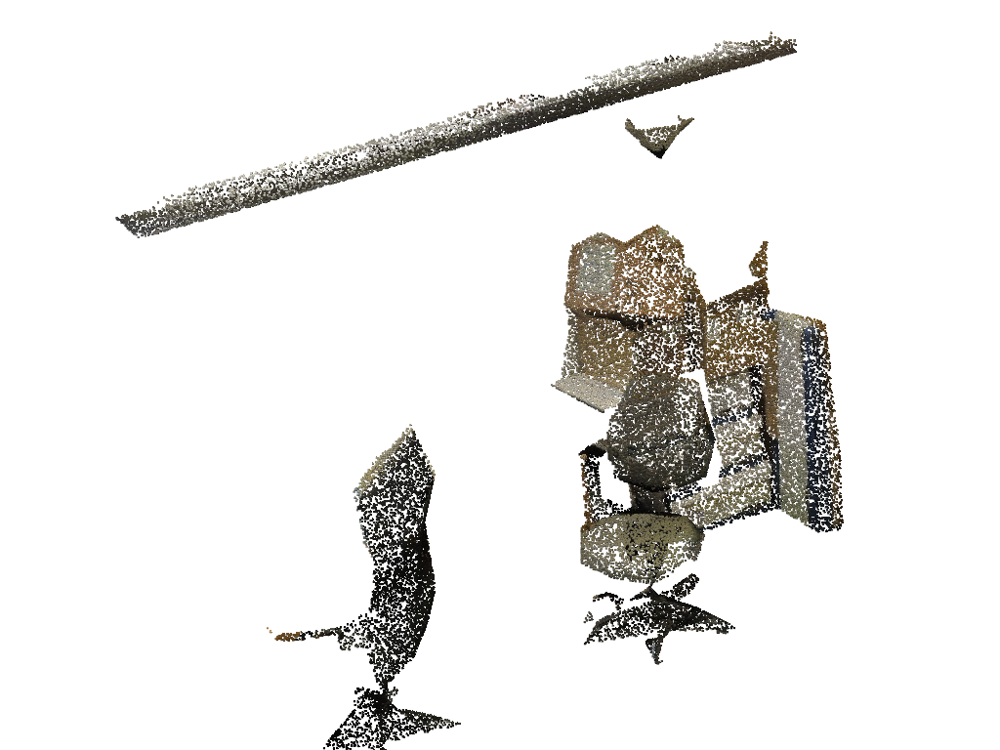
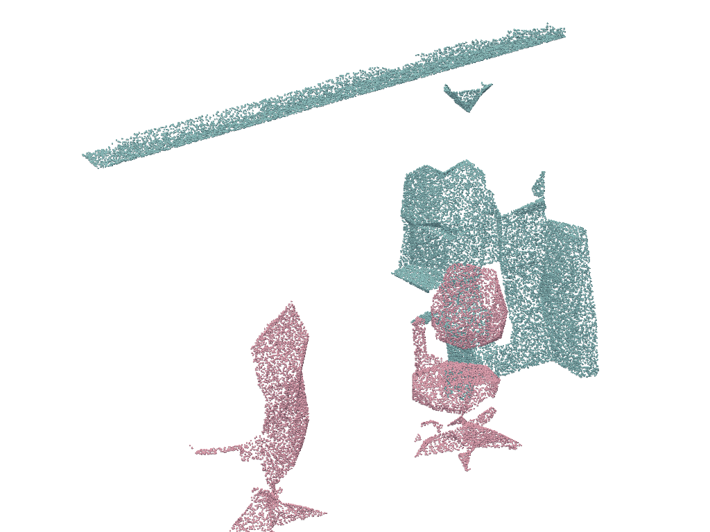
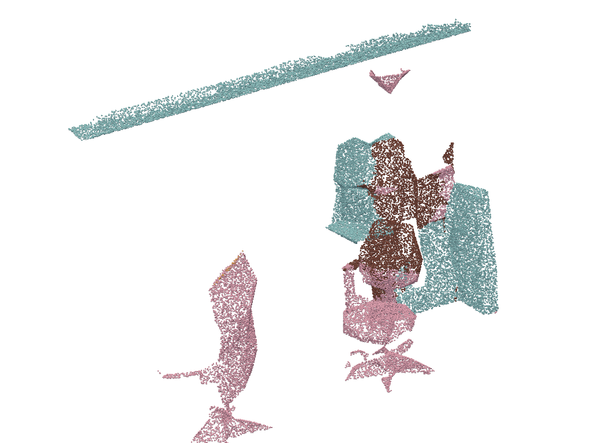
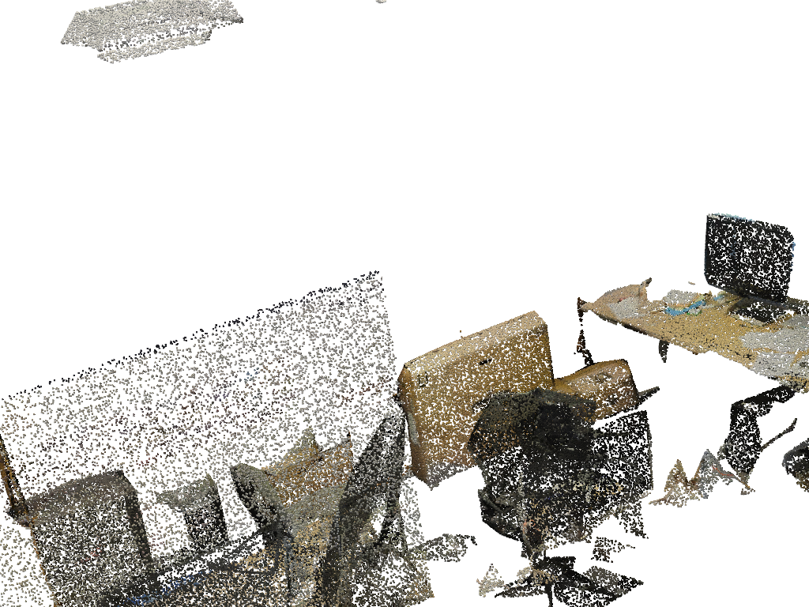
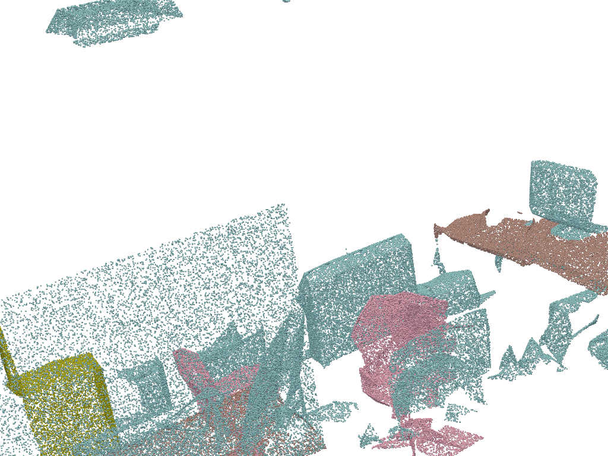
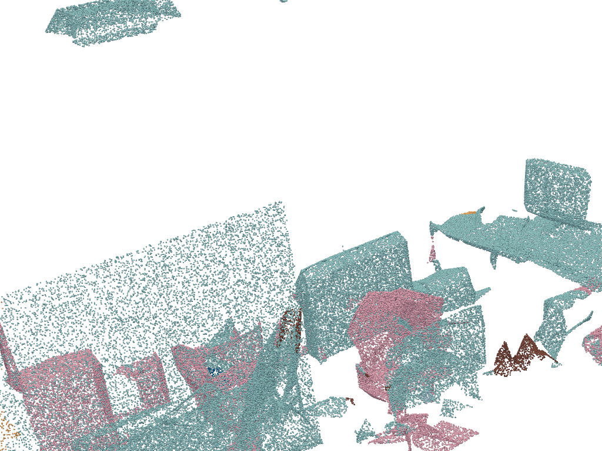
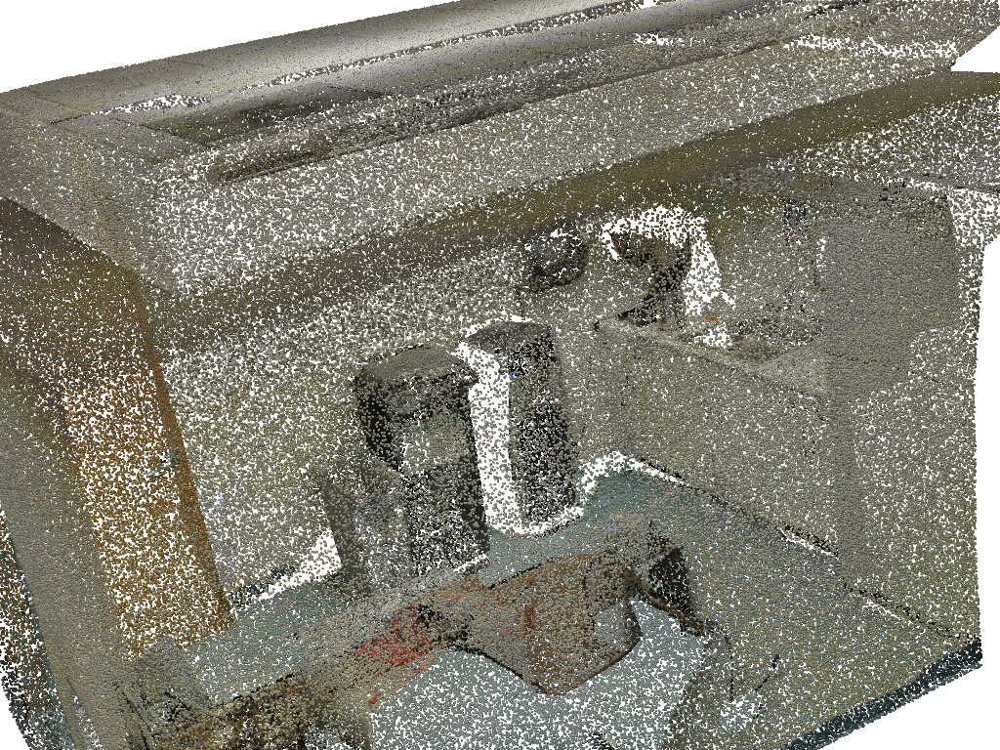
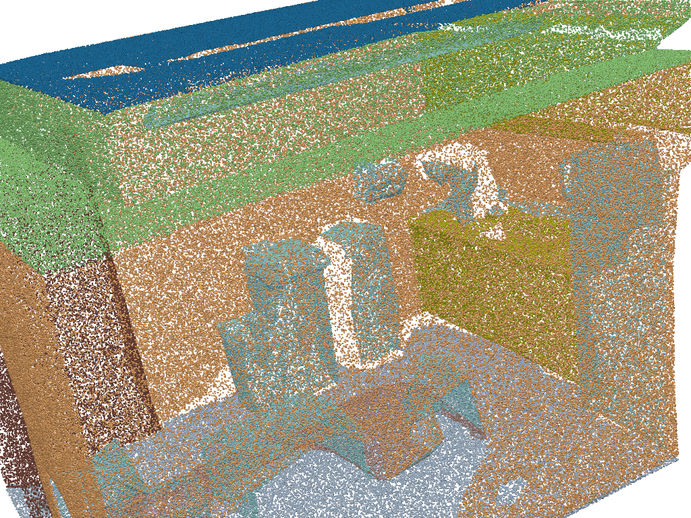
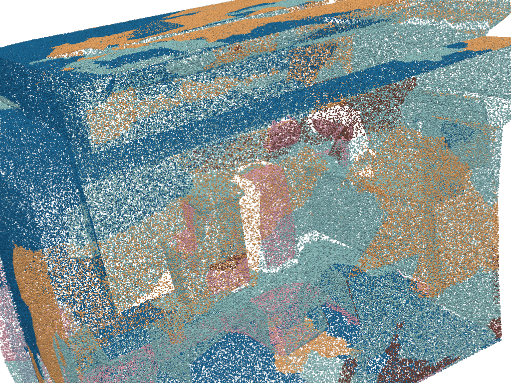

# Обучение нейронной сети PointNet++ для семантической сегментации облака точек.

---

### 2. Цель работы

1.  Освоить принципы работы архитектуры PointNet++.
2.  Приобрести практические навыки подготовки данных 3D-объектов для семантической сегментации.
3.  Проанализировать качество предсказаний модели.

---

### 3. Краткое теоретическое введение

Семантическая сегментация облака точек — это задача присвоения каждой точке в 3D-пространстве метки определенного класса (например, "стена", "пол", "стол"). Это одна из ключевых задач в областях робототехники, беспилотных автомобилей и дополненной реальности.

Архитектура **PointNet++** является развитием новаторской сети PointNet и предназначена для эффективной обработки неупорядоченных наборов точек. Ключевое усовершенствование PointNet++ — это способность изучать локальные признаки в различных масштабах благодаря иерархической структуре. Сеть последовательно группирует точки в локальные области (`sampling & grouping`) и извлекает из них признаки с помощью мини-сетей PointNet. Это позволяет модели улавливать не только глобальную форму объекта, но и мелкие геометрические детали, что критически важно для точной сегментации.

---

### 4. Описание экспериментальной установки

Работа была выполнена в облачной среде Google Colab, что позволило использовать вычислительные мощности GPU для ускорения процесса обучения.

*   **Аппаратное обеспечение:**
    *   **GPU:** NVIDIA Tesla T4 с 15 ГБ видеопамяти.
    *   **CPU:** Intel Xeon.
    *   **RAM:** 12 ГБ системной памяти.

*   **Программное обеспечение:**
    *   **Операционная система:** Ubuntu (в среде Google Colab).
    *   **Язык программирования:** Python 3.12.
    *   **Фреймворк:** PyTorch.
    *   **Основные библиотеки:**
        *   `numpy` для работы с массивами данных.
        *   `open3d` и `pyvista` для обработки и визуализации 3D-данных.
        *   `scikit-learn` для расчета метрик.
        *   `matplotlib` для построения графиков.

*   **Параметры обучения модели:**
    *   **Датасет:** Stanford 3D Indoor Spaces (S3DIS), использовалась только область **Area_1**.
    *   **Архитектура:** PointNet++ для семантической сегментации 13 классов.
    *   **Оптимизатор:** Adam.
    *   **Начальная скорость обучения (Learning Rate):** 0.001.
    *   **Планировщик:** `StepLR` (снижение скорости обучения в 2 раза каждые 20 эпох).
    *   **Количество эпох:** 50.
    *   **Размер батча (Batch Size):** 8.
    *   **Количество точек на сэмпл:** 4096.

---

### 5. Результаты выполнения

#### 5.1. График хода обучения (Loss)

Ниже представлен график функции потерь (Loss) для обучающей (Train) и валидационной (Validation) выборок в течение 50 эпох.

**Анализ графика:**
*   **Кривая обучения (Train Loss):** Синяя линия показывает, что функция потерь на обучающих данных стабильно уменьшается на протяжении всего процесса. Это свидетельствует о том, что модель успешно обучается и настраивает свои веса для минимизации ошибки на данных, которые она видит.
*   **Кривая валидации (Validation Loss):** Оранжевая линия ведет себя иначе. В начале она также уменьшается, следуя за кривой обучения, но затем ее падение замедляется, и она становится очень "шумной", колеблясь в определенном диапазоне.
*   **Вывод:** Наблюдается значительный разрыв между кривыми обучения и валидации. Кривая обучения опускается до значения ~1.2, в то время как кривая валидации остается на уровне ~2.0. Это классический признак **переобучения (overfitting)**. Модель начала "запоминать" обучающие примеры вместо того, чтобы обобщать закономерности. В результате она хорошо работает на знакомых данных, но показывает значительно худшее качество на новых, невиданных ранее данных из валидационного набора.

#### 5.2. Таблица с рассчитанными метриками

После завершения 50 эпох обучения была выбрана модель с наилучшим показателем на валидационной выборке и протестирована на отложенном тестовом наборе данных.

**Итоговые метрики:**

| Метрика | Значение |
| :--- | :--- |
| **Overall Accuracy (OA)** | 0.4816 |
| **Mean Intersection over Union (mIoU)**| 0.1831 |

**IoU по каждому классу:**

| Класс | IoU | Анализ |
| :--- | :-- | :--- |
| ceiling | 0.3617 | Хорошо (крупный, простая геометрия) |
| floor | 0.3426 | Хорошо (крупный, простая геометрия) |
| wall | 0.2064 | Удовлетворительно (часто путается с другими объектами) |
| beam | 0.0000 | Плохо (мало данных, сложная форма) |
| column | 0.0000 | Плохо (мало данных, путается со стенами) |
| window | 0.1795 | Посредственно (встроен в стены) |
| door | 0.0000 | Плохо (мало данных, путается со стенами) |
| table | 0.0000 | Плохо (мало данных, разнообразие форм) |
| chair | 0.4036 | **Лучший результат** (отличимая форма) |
| sofa | `nan` | Класс отсутствовал в тестовой выборке |
| bookcase | 0.0000 | Плохо (мало данных) |
| board | `nan` | Класс отсутствовал в тестовой выборке |
| clutter | 0.5203 | **Лучший результат** (неструктурированные объекты) |

**Анализ качества по классам:**
Модель демонстрирует наилучшие результаты на классах, которые либо занимают большую площадь и имеют простую геометрию (`floor`, `ceiling`), либо имеют характерную и часто встречающуюся форму (`chair`). Интересно, что класс `clutter` (разный мусор, неструктурированные объекты) также определяется хорошо, возможно, потому что модель научилась относить к нему все, что не подходит под другие категории.

Наихудшие результаты (IoU = 0) показаны для большинства предметов мебели и структурных элементов (`table`, `door`, `column`). Это связано с сильным **дисбалансом классов** в датасете: точек, принадлежащих стенам и полам, на порядки больше, чем точек, принадлежащих столам или балкам. Модели не хватило данных, чтобы выучить признаки этих редких классов.

#### 5.3. Скриншоты визуализации результатов

Для визуального анализа были выбраны три тестовые сцены. Для каждой сцены представлено исходное облако точек (реальные цвета), эталонная сегментация (Ground Truth) и результат работы нашей модели (Prediction).

**Сцена 1: `Area_1_office_15`**

| Original | Ground Truth (Эталон) | Prediction (Предсказание) |
| :---: |:---:|:---:|
|  |  |  |

*   **Анализ:** Модель уверенно определяет пол, потолок и стены. Стулья (фиолетовые) определены частично, но их форма угадывается. Столы и другая мебель полностью проигнорированы и классифицированы как `clutter` (бирюзовый), что соответствует нулевому IoU для этих классов.

**Сцена 2: `Area_1_office_17`**

| Original | Ground Truth (Эталон) | Prediction (Предсказание) |
| :---: |:---:|:---:|
|  |  |  |

*   **Анализ:** Аналогичная картина. Крупные структуры определены верно. Модель правильно нашла окно (желтое) в стене. Стулья снова распознаны лишь частично, а стол в центре комнаты полностью потерян.

**Сцена 3: `Area_1_pantry_1` (Кладовая)**

| Original | Ground Truth (Эталон) | Prediction (Предсказание) |
| :---: |:---:|:---:|
|  |  |  |

*   **Анализ:** В этой небольшой сцене модель также хорошо справляется с полом и стенами. Объекты на полках (clutter) определены достаточно точно. Это подтверждает, что модель научилась хорошо сегментировать крупные и аморфные классы.

---

### 6. Ответы на контрольные вопросы

**1. В чем основное ограничение оригинального PointNet, которое преодолевает PointNet++?**
Основное ограничение PointNet заключается в том, что он изучает глобальные признаки всего облака точек, агрегируя информацию со всех точек сразу. При этом он полностью теряет информацию о локальной геометрии и взаимном расположении точек в небольших окрестностях. PointNet++ преодолевает это ограничение, вводя иерархическую структуру. Он рекурсивно разбивает облако на локальные группы точек и применяет к каждой группе мини-PointNet, таким образом изучая локальные геометрические паттерны в разных масштабах.

**2. Каковы основные проблемы при работе с реальными данными 3D-сканирования (на примере S3DIS), влияющие на качество сегментации?**
*   **Неравномерная плотность точек:** Области, расположенные ближе к сканеру, имеют гораздо большую плотность точек, чем удаленные. Модель должна быть устойчива к таким изменениям плотности.
*   **Окклюзии (перекрытия):** Часть объектов может быть не видна сканеру, так как она закрыта другими объектами. Это приводит к "дырам" и неполным данным.
*   **Шум и выбросы:** В данных всегда присутствуют случайные точки-выбросы и небольшой шум в координатах, вызванные несовершенством сенсоров.
*   **Сильный дисбаланс классов:** Количество точек, принадлежащих крупным классам (стены, пол), на несколько порядков превышает количество точек малых объектов (стулья, столы), что затрудняет обучение модели на редких классах.

**3. Почему метрика mIoU является более информативной по сравнению с Overall Accuracy для задачи семантической сегментации?**
`Overall Accuracy` (OA) — это просто доля правильно классифицированных точек от их общего числа. В условиях сильного дисбаланса классов эта метрика может вводить в заблуждение. Например, если 90% всех точек в сцене — это стены и пол, модель, которая правильно определяет только их, а все остальные объекты — неверно, будет иметь OA около 90%, что выглядит как отличный результат, хотя на самом деле модель бесполезна для распознавания мебели.

`Mean Intersection over Union` (mIoU) решает эту проблему. Она вычисляет метрику IoU (пересечение над объединением) для *каждого класса* отдельно, а затем усредняет эти значения. Таким образом, вклад каждого класса в итоговую метрику становится одинаковым, независимо от его размера. Плохая работа на маленьком классе "стул" так же сильно понизит итоговый mIoU, как и плохая работа на огромном классе "стена". Это делает mIoU гораздо более честной и информативной метрикой для оценки качества сегментации.

---

### 7. Выводы по работе

В ходе выполнения данной лабораторной работы были достигнуты поставленные цели.

1.  **Освоены принципы работы PointNet++:** На практике была изучена и применена иерархическая архитектура для извлечения локальных и глобальных признаков из облака точек.
2.  **Приобретены навыки подготовки данных:** Был выполнен полный цикл работы с датасетом S3DIS, включая его предобработку, создание кастомного класса `Dataset` в PyTorch и разделение на выборки.
3.  **Проведен анализ качества модели:** Была успешно обучена модель, которая показала итоговые метрики **OA = 0.4816** и **mIoU = 0.1831**.

**Трудности и пути улучшения:**
*   **Переобучение:** Главной проблемой стало сильное переобучение модели, что видно по графику потерь. Это связано с тем, что для обучения использовалась только одна область (`Area_1`) датасета.
*   **Дисбаланс классов:** Модель показала очень низкое качество на редких классах (мебель, структурные элементы).

**Возможные пути улучшения модели:**
1.  **Увеличение объема данных:** Использовать для обучения все 6 областей датасета S3DIS.
2.  **Борьба с переобучением:** Применить более агрессивные техники регуляризации (например, Dropout) или использовать `Early Stopping`.
3.  **Борьба с дисбалансом:** Использовать взвешенную функцию потерь (`Weighted Cross-Entropy Loss`), которая будет сильнее штрафовать за ошибки на редких классах.
4.  **Аугментация данных:** Применить более сложные аугментации, такие как случайное масштабирование, добавление шума или эластичные деформации облака точек.

В целом, работа была выполнена успешно. Полученная модель, несмотря на скромные метрики, демонстрирует базовую способность к семантической сегментации, а выявленные проблемы указывают на ясные пути для дальнейшего улучшения ее качества.