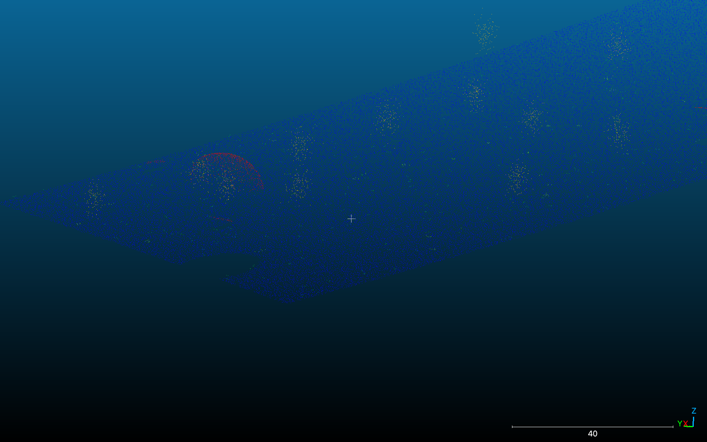
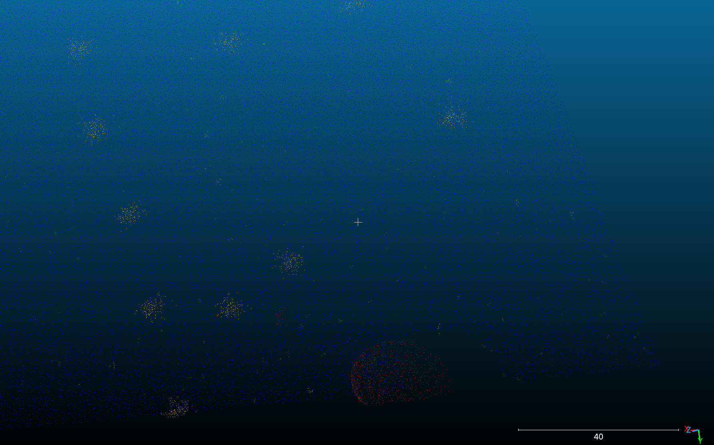
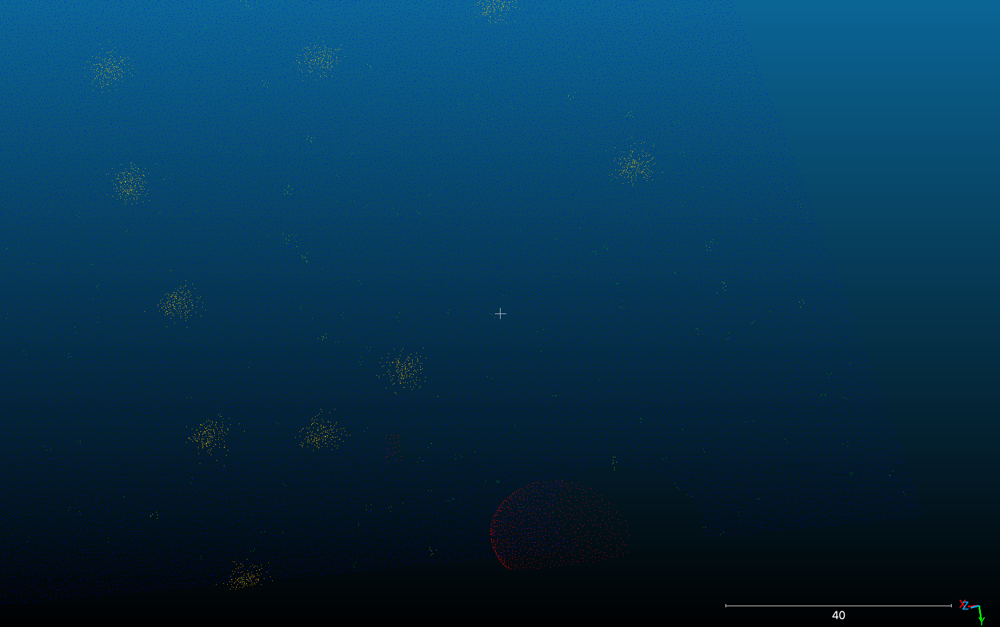

# Subsampling в CloudCompare

## Цель работы
Целью данной работы было изучить функцию subsampling в программе CloudCompare и сравнить разные методы уменьшения количества точек в облаке без сильной потери геометрической информации.

---

## Исходные данные
В качестве исходных данных использовалось облако точек, загруженное в CloudCompare.

- Количество точек в исходном облаке: **158 953**

Для уменьшения количества точек были применены три метода субсэмплинга:
- Random
- Spatial (Spatially uniform)
- Octree-based

---

## Использованные параметры

- **Spatial (Spatially uniform):**
  - min space between points = **0.5055**

- **Octree-based:**
  - subdivision level = **8**

- **Random:**
  - количество точек = **79 476**

---

## Результаты субсэмплинга

После применения каждого метода было сохранено новое облако точек и выполнено сравнение количества точек.

### Таблица сравнения

| Метод | Количество точек |
|------|------------------|
| Исходное облако | 158 953 |
| Spatial | 78 081 |
| Random | 79 770 |
| Octree | 77 906 |

Во всех случаях количество точек уменьшилось примерно в два раза.

---

## Визуальное сравнение
Для визуального сравнения использовалась функция Toggle Visibility в дереве объектов CloudCompare.  
Было видно, что разные методы по-разному влияют на плотность и равномерность точек.

---

## Ответы на вопросы

### 1. Какой метод дал наилучший визуальный результат при уменьшении количества точек вдвое?
Наилучший визуальный результат показал метод **Spatial (Spatially uniform)**.  
Облако точек осталось равномерным, форма объекта хорошо сохранилась, без заметных разрывов и пропусков.

### 2. Как изменяется точность геометрии при различных методах субсэмплинга?
- **Spatial** лучше всего сохраняет геометрию и структуру объекта.
- **Octree-based** тоже даёт хороший результат, но иногда упрощает мелкие детали.
- **Random** сохраняет общее количество точек, но распределение получается неравномерным, из-за чего геометрия выглядит менее точно.

### 3. Какой способ оказался самым быстрым?
Самым быстрым оказался метод **Random**, так как он просто случайно выбирает точки.  
Метод **Octree** работает достаточно быстро.  
**Spatial** оказался самым медленным, потому что учитывает расстояние между точками.

### 4. Какие параметры были оптимальными для сохранения структуры объекта?
- Для **Spatial** параметр min space between points = **0.5055** оказался оптимальным, так как позволил уменьшить количество точек примерно вдвое без сильной потери формы.
- Для **Octree** subdivision level = **8** обеспечил хорошее соотношение между качеством и степенью разрежения.
- Для **Random** выбор около **80 000** точек оказался приемлемым, но визуально этот метод хуже других.

---

## Вывод
В ходе работы были изучены три метода субсэмплинга в CloudCompare.  
Лучшее качество при уменьшении количества точек примерно в два раза показал метод **Spatial (Spatially uniform)**.  
Метод **Random** уступает по качеству но быстрый .  
Метод **Octree-based** хорошо сохранил структуру объекта и быстрый.

## Скрины

## Random

  
  

## Octree

  
  

## Sparcial

  
  

