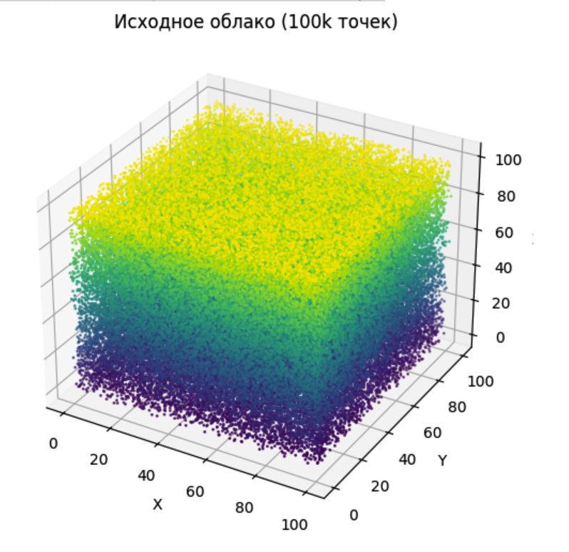
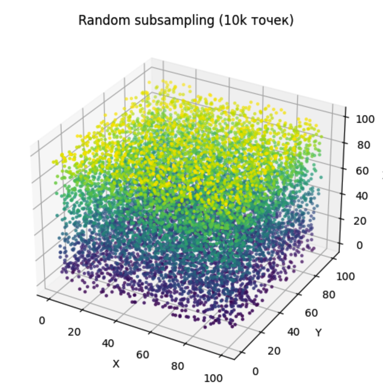
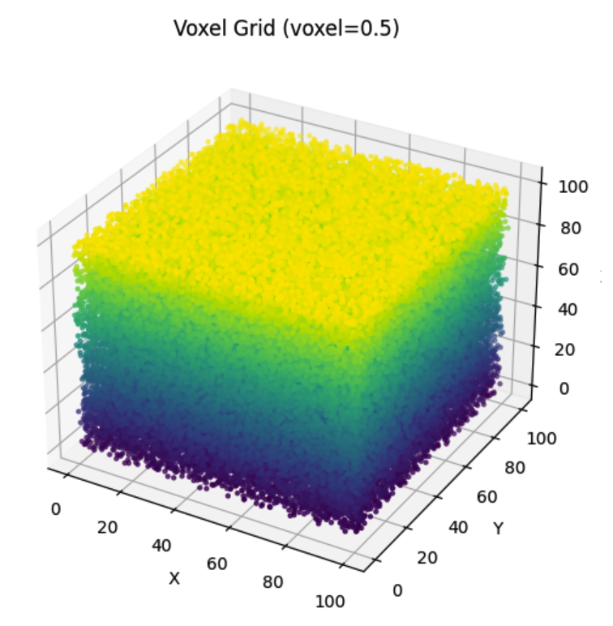

# Отчёт по заданию 1b
## скрины

  
  
  

## 1. Влияние размера выборки на визуальное качество облака
- При Random subsampling уменьшение числа точек до 10 000 делает облако менее плотным (Основная форма сохраняется, но мелкие структуры теряются)
- Для Voxel Grid уменьшение размера вокселя улучшает детализацию, увеличение — упрощает форму.

## 2. Влияние размера вокселя в voxel_grid_subsampling на детализацию
- Малый размер вокселя (например, 0.5) → облако плотное, форма куба хорошо видна, детали сохраняются.
- Большой размер вокселя (например, 5.0) → облако редкое, детали теряются, форма грубо приближена.
- Размер вокселя управляет «разрешением» облака.

## 3. Эффективность методов по времени
- **Random subsampling** — очень быстрый, время почти не зависит от структуры облака.
- **Voxel Grid subsampling** — чуть медленнее, но всё ещё быстро; скорость зависит от числа уникальных вокселей.

- Примеры замеров:
  - Random: ~0.0049 секунд сек для 10 000 точек
  - Voxel Grid: ~0.2788 секунд для voxel_size=0.5

## 4. Сохранение геометрии объекта
- **Random subsampling** сохраняет форму в среднем, но точки распределены случайно, могут быть пропуски.
- **Voxel Grid** лучше сохраняет общую форму и равномерно покрывает 
пространство, особенно для кубических или равномерных структур.

## 5. Заключение
Если требуется максимальная скорость — лучше использовать Random subsampling.Если важна равномерная детализация и сохранение формы объекта — предпочтительнее Voxel Grid.
