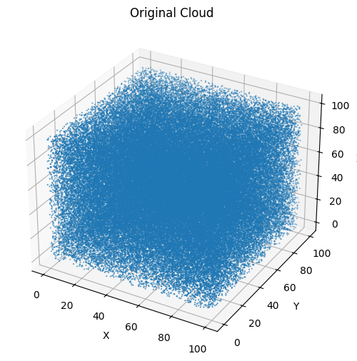
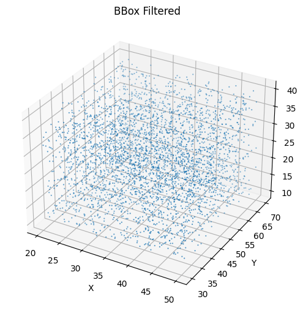
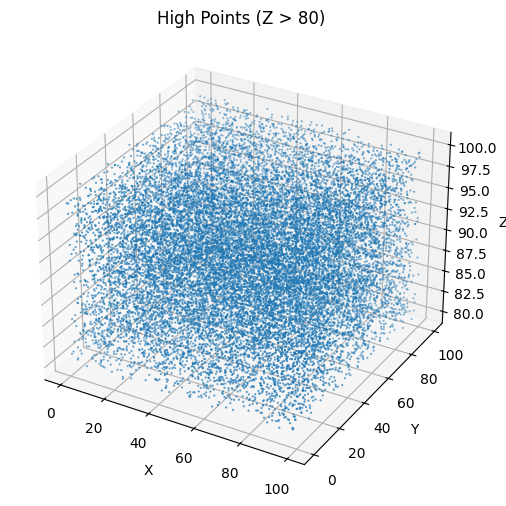
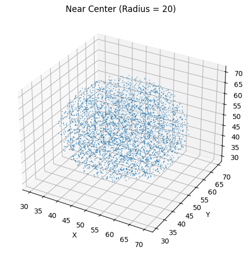

# Отчёт по заданию 2b  
## Выделение областей в облаке точек

## Цель работы
Изучить методы сегментации облака точек с использованием Python и библиотеки NumPy.

## Исходные данные
Сгенерировано искусственное облако из **100 000 точек**, равномерно распределённых в кубе  
**100 × 100 × 100**. Формат данных — XYZ.

## Выполненные методы фильтрации

### 1. Bounding Box
Выделены точки внутри объёма:
- X ∈ [20, 50]
- Y ∈ [30, 70]
- Z ∈ [10, 40]

Результат сохранён в файл `bbox_filtered.xyz`.

### 2. Фильтрация по высоте
Выделены точки с координатой:
- Z > 80

Результат сохранён в файл `high_points.xyz`.

### 3. Фильтрация по расстоянию
Выделены точки в радиусе **20** от центра **(50, 50, 50)**.

Результат сохранён в файл `near_center.xyz`.

### 4. Дополнительно: круг в плоскости XY
Выделены точки внутри круга:
- Центр: (50, 50)
- Радиус: 30

Результат сохранён в файл `circle_xy.xyz`.

## Визуализация
Выполнена 3D-визуализация исходного облака и результатов всех фильтраций.

## Выводы
- Bounding Box удобен для выделения прямоугольных областей
- Фильтрация по Z эффективна для анализа высотных слоёв
- Радиусная фильтрация позволяет выделять локальные области
- Геометрические фильтры дают гибкие способы сегментации облаков точек
