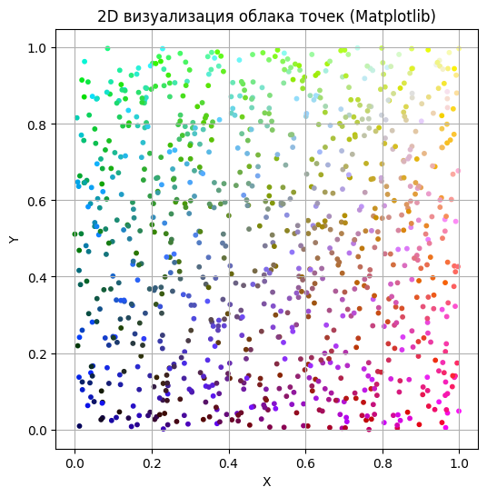
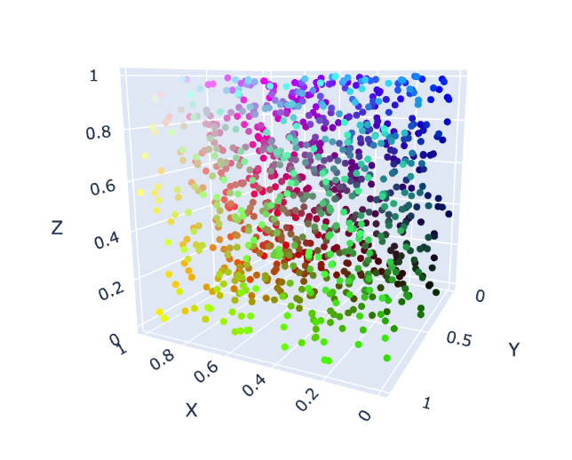
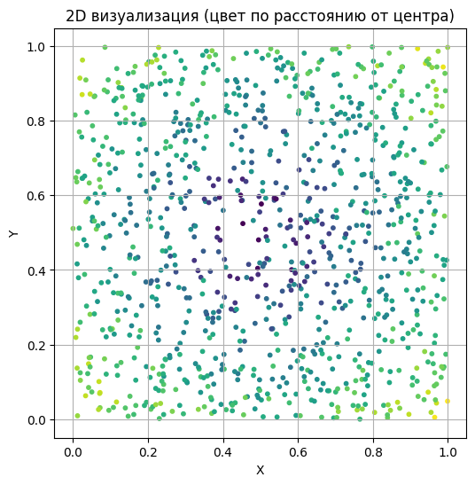
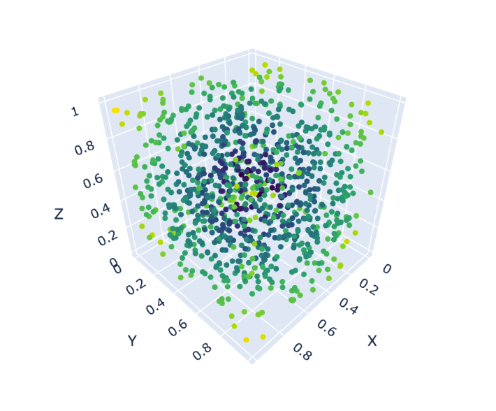

# Задание 2

---

## 1. Цель работы
- Научиться визуализировать облака точек с цветовой информацией.  
- Использовать координаты и скалярные параметры точек для задания цвета.  
- Сравнить статичную 2D визуализацию (Matplotlib) и интерактивную 3D визуализацию (Plotly).

---

## 2. Исходные данные
- Облако точек: 1000 точек, равномерно распределённых в кубе [0,1]³.  
- Основная цветовая схема: R=X, G=Y, B=Z (нормализовано в [0,1]).  
- Альтернативная схема: цвет зависит от расстояния до центра куба `(0.5,0.5,0.5)` через colormap `viridis`.

---

## 3. Ход работы
1. Сгенерировано облако точек в кубе [0,1]³.  
2. Присвоены цвета точкам по их координатам: R=X, G=Y, B=Z.  
3. Выполнена 2D визуализация XY-проекции через Matplotlib.  
4. Создана интерактивная 3D визуализация с использованием Plotly.  
5. Создана альтернативная цветовая схема по расстоянию до центра, визуализирована в 2D и 3D.  

---

## 4. Графики
1. **2D XY облако точек с цветом по координатам**  
     

2. **3D облако точек с цветом по координатам (Plotly)**  
     

3. **2D облако точек с цветом по расстоянию до центра**  
     

4. **3D облако точек с цветом по расстоянию до центра**  
     

---

## 5. Ответы на контрольные вопросы

### Общие понятия
1. **Что такое облако точек и какие данные оно обычно содержит?**  
   - Набор координат (X,Y,Z), иногда с дополнительными параметрами: цвет, интенсивность, категория.  

2. **Как представляется цвет в модели RGB?**  
   - Три компонента: R, G, B, каждая в диапазоне [0,1] (Matplotlib) или [0,255] (Plotly).  

3. **В каком диапазоне должны находиться значения RGB для визуализации?**  
   - Соответственно [0,1] или [0,255], чтобы корректно отображать цвета.  

4. **Что такое нормализация значений и зачем она нужна при работе с цветами?**  
   - Приведение данных к допустимому диапазону [0,1] для корректного отображения и использования colormap.  

5. **Чем отличается абсолютный цвет от вычисляемого?**  
   - Абсолютный: задан вручную.  
   - Вычисляемый: зависит от координаты, расстояния или скалярного поля.

---

### Работа с NumPy и цветами
6. **Как с помощью NumPy можно задать цвет каждой точке на основе её координаты?**  
   - `colors = points.copy()` или через отдельные колонки: `colors[:,0] = points[:,0]`.  

7. **Как вычислить расстояние от точки до центра пространства с помощью NumPy?**  
   - `dist = np.linalg.norm(points - center, axis=1)`.  

8. **Как задать градиент цвета по оси X, Y или Z?**  
   - Присвоить соответствующую координату каждой компоненте цвета: R=X, G=Y, B=Z.  

9. **Как преобразовать массив float значений в нормализованный массив для colormap?**  
   - `(values - values.min()) / (values.max() - values.min())`.

---

### Matplotlib и цветовая визуализация
10. **Как используется параметр `c=` в функции `plt.scatter()`?**  
    - Задаёт цвет каждой точки; принимает массив RGB или скалярные значения с colormap.  

11. **Что такое colormap в Matplotlib и как его применить к облаку точек?**  
    - Преобразует скалярные значения в цвета. Используется через `plt.cm.viridis(normed_values)`.  

12. **Какие бывают цветовые карты (colormaps) и как выбрать подходящую?**  
    - `viridis`, `plasma`, `inferno`, `magma`, `coolwarm` и др. Выбор зависит от задачи: последовательная или категориальная шкала.  

13. **Как отобразить цветовую шкалу (legend) на графике?**  
    - Через `plt.colorbar()` после `scatter` с colormap.

---

### Plotly и интерактивность
14. **Как создаётся 3D-график с помощью `plotly.graph_objects`?**  
    - Используется `go.Scatter3d(x, y, z, marker=dict(color=colors))`.  

15. **Как задать цвет каждой точки вручную в формате `'rgb(R,G,B)'` в Plotly?**  
    - Формируем список строк: `['rgb({},{},{})'.format(int(r*255), int(g*255), int(b*255)) for r,g,b in colors]`.  

16. **В чём преимущества интерактивной визуализации по сравнению со статичной?**  
    - Позволяет вращать, масштабировать и исследовать 3D структуру облака.  

17. **Какие параметры можно задать в Plotly для изменения внешнего вида маркеров?**  
    - `size`, `symbol`, `opacity`, `color`.

---

### Дополнительно — сохранение и экспорт
18. **Как можно сохранить облако точек с цветами в файл (.ply, .csv)?**  
    - Через `np.savetxt('cloud.csv', points_with_colors)` или специализированные библиотеки (`open3d`).  

19. **Как можно использовать цвет как способ отображения дополнительных данных?**  
    - Температура, интенсивность, категория объектов, высота.  

20. **Что произойдёт, если задать некорректные значения RGB (например, больше 1.0 или отрицательные)?**  
    - Цвета будут отображаться некорректно, возможны ошибки или белые/чёрные точки.

---

### Развивающие (применение на практике)
21. **Как можно применить цветовую визуализацию при анализе ландшафта, сканов зданий, 3D-моделей, научных данных?**  
    - Для оценки высоты, распределения объектов, температурных или интенсивностных карт.  

22. **Как можно визуализировать разные классы точек с помощью цветов?**  
    - Присвоить каждой категории уникальный цвет.  

23. **Что лучше выбрать для презентации результатов: Matplotlib или Plotly? Почему?**  
    - Статичная отчётная визуализация: Matplotlib.  
    - Интерактивная презентация, исследование больших облаков точек: Plotly.

---

## 6. Выводы
- Освоены методы задания цвета точкам на основе координат и скалярных величин.  
- Интерактивная визуализация Plotly позволяет оценить структуру облака точек в 3D.  
- Цвет кодирует дополнительную информацию: высоту, категорию или расстояние до центра.  
- Методы применимы в LIDAR, 3D моделировании, геодезии и научной визуализации.
