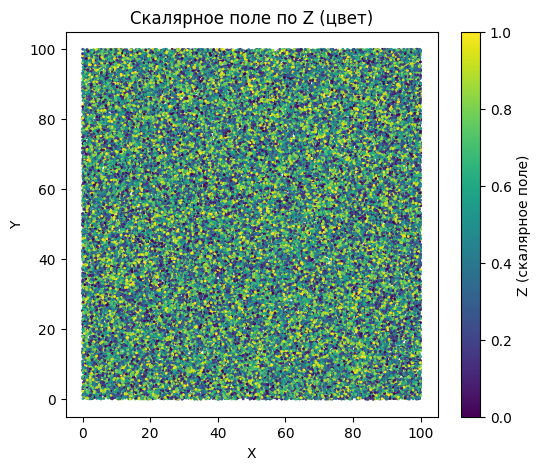
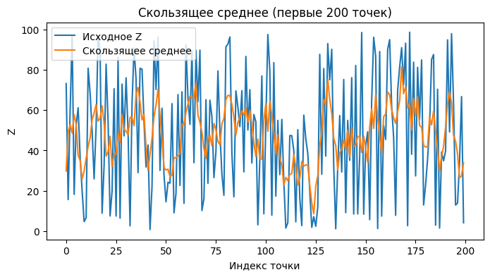

## Задание 4. Работа со скалярными полями в Python (NumPy)

## 1. Цель работы
- Изучить создание и обработку скалярных полей, связанных с облаками точек,  
- Научиться применять фильтры, сглаживание, градиенты, нормализацию, визуализацию и интерполяцию.

---

## 2. Исходные данные
- Искусственное облако точек: 100 000 точек в кубе 0–100, формат Nx3 (X, Y, Z).  
- Первичный скалярный параметр: координата Z точек.

---

## 3. Ход работы

### Задание 1-3. Константное скалярное поле
- Создано поле `scalar_field = 10`, умножено на 2 и увеличено на 5 → `[25, 25, …]`.  
- Используется для демонстрации базовых операций.  

### Переход к реальному скалярному полю
- Для всех последующих анализов использована **координата Z** (`scalar_field = xyz[:,2]`).

### Задание 4. Гауссово сглаживание
- Применён фильтр `gaussian_filter1d(sigma=2)`.  
- График 1: видно, как шумные значения сглаживаются.  

### Задание 5. Градиент
- Вычислен градиент `np.gradient(scalar_field)`.  
- Позволяет выявить локальные перепады высот.  
- График 2: градиент первых 200 точек.

### Задание 6. Скользящее среднее
- Применено усреднение по окну 5.  
- График 3: сглаженные значения визуально ближе к гауссовым.  

### Задание 7. Преобразование в RGB
- Нормализованные значения Z переведены в цвета по карте `viridis`.  
- График 4: цветовое облако точек по Z.

### Задание 8. Статистика
| Параметр | Значение |
|-----------|----------|
| Среднее   | 50.047   |
| Std       | 28.857   |
| Min       | 0.000    |
| Max       | 99.999   |

### Задание 9. Нормализация
- Значения Z приведены к диапазону `[0, 1]` для последующей визуализации.

### Задание 10. Интерполяция пропусков
- Искусственные NaN (каждая 1000-я точка) заменены функцией `interp1d(..., fill_value="extrapolate")`.  
- Экстраполяция на краях возможна (например, первый элемент отрицательный).

### Задание 11. Фильтрация по значению
- Фильтр `(20 <= Z <= 80)` оставил 59 932 точки из 100 000.  

### Задание 12. Использование скалярного поля как Z
- Z координата точек заменена скалярным полем → облако окрашено и визуализировано по высоте.

### Задание 13. Удаление скалярного поля
- `scalar_field = None` после всех вычислений и визуализаций.

---

## 4. Графики
1. **Цветовое облако точек по Z**  
   
2. **Гауссово сглаживание (первые 200 точек)**  
   
3. **Скользящее среднее (первые 200 точек)**  
   
4. **Градиент (первые 200 точек)**  
   

---

## 5. Ответы на вопросы

1. **Облако точек** — набор 3D координат (X, Y, Z), часто с интенсивностью или цветом.  
2. **Скалярное поле** — значение, связанное с каждой точкой, например Z, интенсивность, температура.  
3. Связь: каждая точка получает одно или несколько численных значений.  
4. Примеры реальных полей: LIDAR — высота, фотограмметрия — яркость.  
5. NumPy: `np.full(N, value)` или `xyz[:,2].copy()`.  
6. Добавление константы: `scalar_field += 5`.  
7. Умножение на коэффициент: `scalar_field *= 2`.  
8. Нормализация [0,1] масштабирует значения к единому диапазону, сохраняя пропорции.  
9. Статистические параметры: min, max, mean, std.  
10. Интерпретация: min/max — границы, mean — среднее, std — разброс.  
11. Гауссов фильтр сглаживает шум, учитывая соседние точки.  
12. Скользящее среднее — простое локальное сглаживание; гауссов фильтр — более плавное.  
13. Визуализация через цветовую карту показывает распределение значения скалярного поля.  
14. Скалярное поле как Z позволяет визуализировать данные по значению поля.  
15. Некорректная нормализация приведёт к некорректным цветам или NaN.  
16. Пропущенные значения: `np.isnan(scalar_field)`.  
17. Интерполяция: заполнение NaN по соседним точкам, `interp1d`.  
18. Фильтрация: `mask = (scalar_field >= min_val) & (scalar_field <= max_val)`.  
19. Библиотеки: `matplotlib`, `open3d` — визуализация; `scipy.ndimage` — фильтры; `matplotlib.cm` — цвет.  
20. Добавление скалярного поля: `scalar_field = xyz[:,2].copy()`, нормализация, карта цветов, привязка к облаку точек.  
21. Сглаживание важно для уменьшения шума и выявления тенденций.  
22. Большой σ → сильное сглаживание, потеря мелких деталей.  
23. Шум визуально проявляется как резкие скачки на графике скалярного поля.  
24. Если поле содержит NaN, использование как Z не корректно, нужно интерполировать или удалить NaN.

---

## 6. Выводы
- Скалярные поля удобно анализировать и визуализировать по цвету.  
- Гауссов фильтр и скользящее среднее эффективны для сглаживания шума.  
- Градиент и фильтрация помогают выявлять локальные особенности.  
- Методы применимы к LIDAR, фотограмметрии, топографии.  
- В отчёте продемонстрированы как базовые арифметические операции, так и полноценная визуализация.
