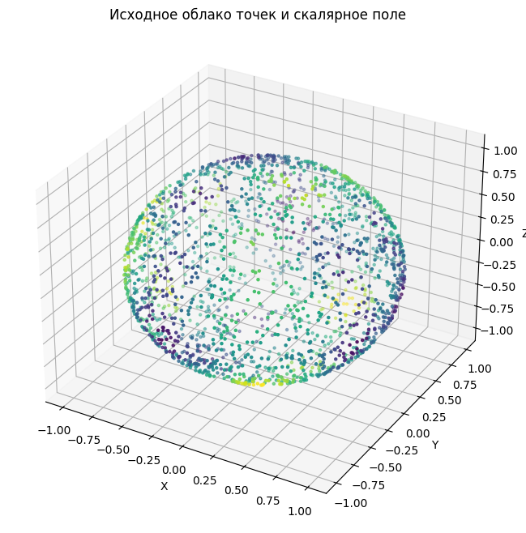
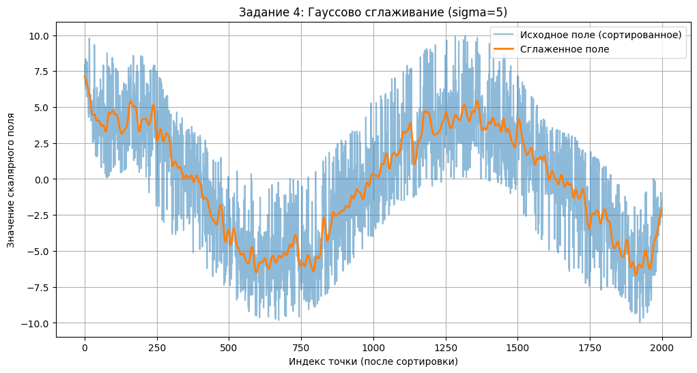
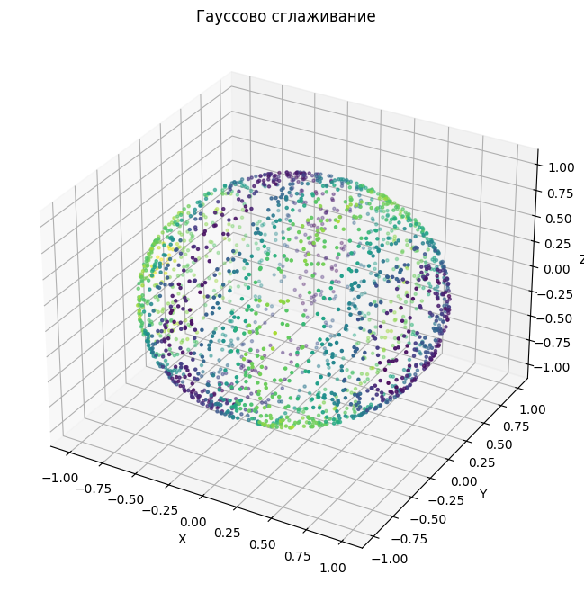
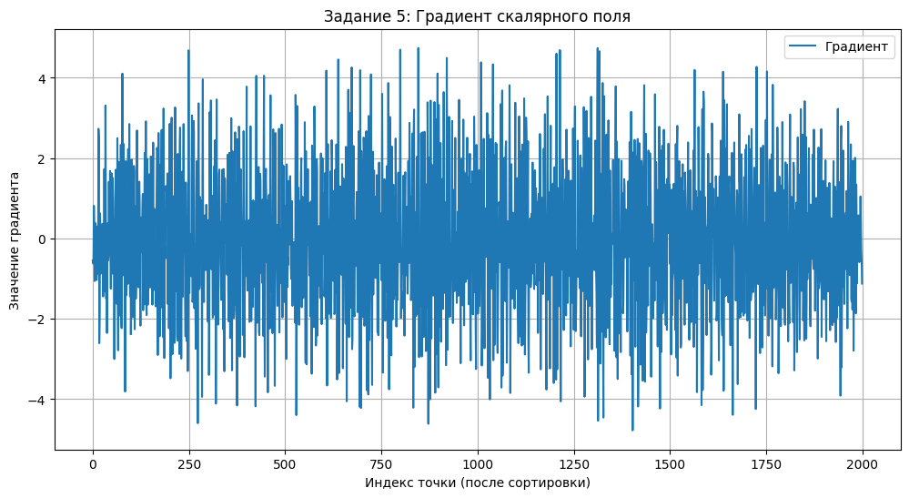
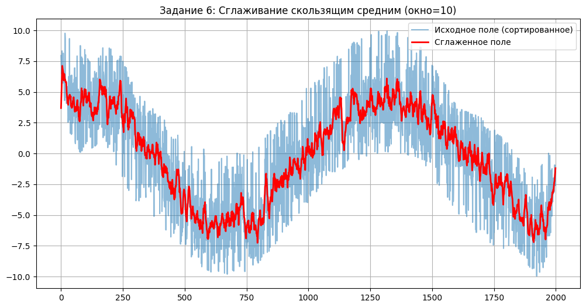
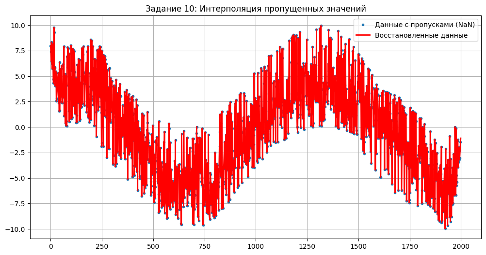
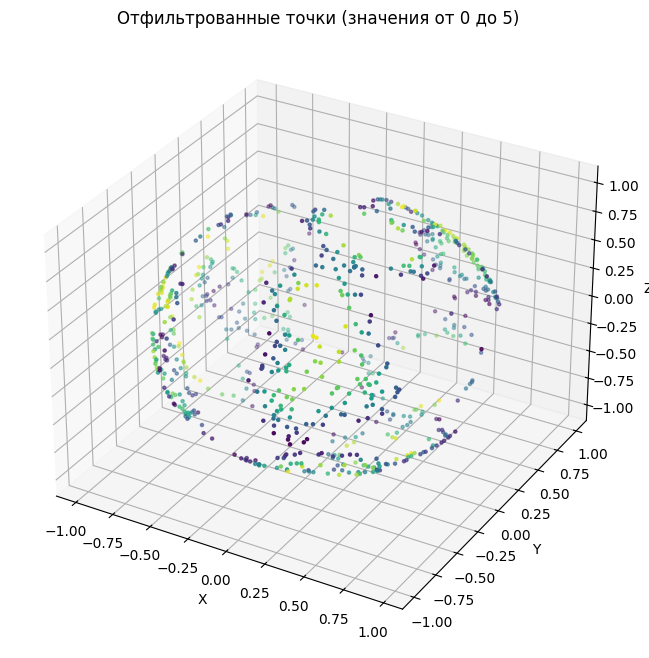
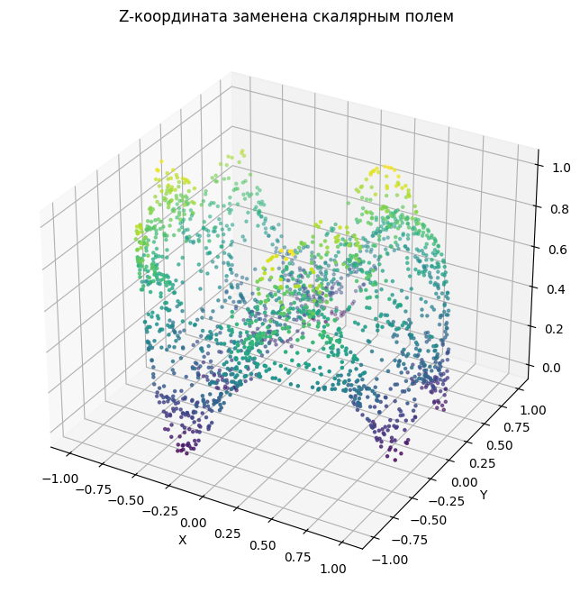

# Задание 4. Работа со скалярными полями в Python (NumPy)

### **2. Цель работы**

Изучить методы создания, обработки и анализа скалярных полей, привязанных к облакам точек, с использованием Python и библиотеки NumPy, а также закрепить навыки визуализации данных.

---

### **3. Исходные данные**

*   **Описание облака точек:**
    *   Данные были сгенерированы программно, так как файл не был предоставлен.
    *   **Формат:** Массив NumPy.
    *   **Количество точек:** 2000.
    *   **Структура:** Точки распределены по поверхности сферы.
*   **Первичный скалярный параметр:**
    *   Скалярное поле было создано на основе XYZ-координат точек с помощью комбинации синусоидальных функций.
    *   **Диапазон исходных значений:** от -9.97 до 9.94.

---

### **4. Ход работы**

#### **Генерация и первичная визуализация**
*   **Цель:** Создать набор данных для выполнения заданий.
*   **Исходный код:**
    ```python
    n_points = 2000
    phi = np.random.uniform(0, 2 * np.pi, n_points)
    costheta = np.random.uniform(-1, 1, n_points)
    theta = np.arccos(costheta)
    x = np.sin(theta) * np.cos(phi)
    y = np.sin(theta) * np.sin(phi)
    z = np.cos(theta)
    xyz = np.vstack((x, y, z)).T
    scalar_field = 5 * np.sin(5*x) + 3 * np.cos(10*y) + 2 * np.sin(7*z)
    ```
*   **График:**
    
*   **Комментарий:** Создано облако из 2000 точек и привязанное к нему скалярное поле. Цвета на визуализации соответствуют значениям поля (синий - min, желтый - max).

#### **Задание 1. Добавить скалярное поле с постоянным значением**
*   **Цель:** Создать новое скалярное поле, где все значения равны константе.
*   **Исходный код:** `scalar_field_const = np.full(xyz.shape[0], 10.0)`
*   **Комментарий:** Создан массив из 2000 элементов, каждый из которых равен `10.0`.

#### **Задание 2. Умножить скалярное поле на число**
*   **Цель:** Масштабировать значения исходного скалярного поля.
*   **Исходный код:** `scalar_field_mult = scalar_field * 2`
*   **Комментарий:** Все значения в поле были умножены на 2. Диапазон изменился с `[-9.97, 9.94]` на `[-19.93, 19.89]`.

#### **Задание 3. Добавить число к значениям скалярного поля**
*   **Цель:** Сместить значения исходного скалярного поля.
*   **Исходный код:** `scalar_field_add = scalar_field + 5`
*   **Комментарий:** Ко всем значениям было прибавлено 5. Диапазон изменился на `[-4.97, 14.94]`.

#### **Задание 4. Применить гауссов фильтр (сглаживание)**
*   **Цель:** Устранить шум и резкие колебания в данных.
*   **Исходный код:**
    ```python
    from scipy.ndimage import gaussian_filter1d
    sort_indices = np.argsort(xyz[:, 0])
    scalar_sorted = scalar_field[sort_indices]
    smoothed_scalar_gauss = gaussian_filter1d(scalar_sorted, sigma=5)
    ```
*   **Графики:**
    
    
*   **Комментарий:** Сглаживание сделало переходы значений более плавными, что видно как на 2D-графике, так и на 3D-модели (цветовые переходы стали мягче).

#### **Задание 5. Вычислить градиент скалярного поля**
*   **Цель:** Оценить скорость изменения скалярного поля.
*   **Исходный код:** `gradient = np.gradient(scalar_sorted)`
*   **График:**
    
*   **Комментарий:** Градиент показывает, где происходят самые резкие изменения значений. Диапазон градиента: от -4.78 до 4.74.

#### **Задание 6. Повторное сглаживание (скользящее среднее)**
*   **Цель:** Применить альтернативный метод сглаживания.
*   **Исходный код:**
    ```python
    def moving_average(data, window_size=10):
        return np.convolve(data, np.ones(window_size)/window_size, mode='same')
    smoothed_ma = moving_average(scalar_sorted, window_size=10)
    ```
*   **График:**
    
*   **Комментарий:** Метод также эффективно сгладил данные. Результат визуально схож с гауссовым фильтром.

#### **Задание 7. Преобразовать скалярное поле в RGB цвета**
*   **Цель:** Подготовить данные для цветной визуализации.
*   **Исходный код:**
    ```python
    normed = (scalar_field - scalar_field.min()) / (scalar_field.max() - scalar_field.min())
    colors = plt.cm.viridis(normed)[:, :3]
    ```
*   **Комментарий:** Создан массив NumPy формы (2000, 3), где каждая строка является RGB-кодом цвета для соответствующей точки.

#### **Задание 8. Вычислить статистические параметры**
*   **Цель:** Получить сводную информацию о распределении значений поля.
*   **Исходный код:**
    ```python
    mean = scalar_field.mean()
    std = scalar_field.std()
    min_val = scalar_field.min()
    max_val = scalar_field.max()
    ```
*   **Комментарий:** Получены ключевые статистики: среднее (-0.1873), ст. отклонение (4.4456), минимум (-9.9668), максимум (9.9447).

#### **Задание 9. Нормализовать значения в диапазон [0, 1]**
*   **Цель:** Привести значения к стандартному диапазону.
*   **Исходный код:** `normed = (scalar_field - min_val) / (max_val - min_val)`
*   **Комментарий:** Все значения поля были линейно масштабированы в диапазон от 0.00 до 1.00. Это необходимо для корректного применения цветовых карт.

#### **Задание 10. Интерполировать скалярное поле**
*   **Цель:** Заполнить пропущенные значения в данных.
*   **Исходный код:**
    ```python
    # ... создание scalar_with_nan ...
    def interpolate_nan(data):
        # ... реализация ...
    filled_scalar = interpolate_nan(scalar_with_nan)
    ```
*   **График:**
    
*   **Комментарий:** Искусственно созданные пропуски (NaN) были успешно восстановлены методом линейной интерполяции.

#### **Задание 11. Фильтрация по значению скалярного поля**
*   **Цель:** Выделить подмножество точек по заданному критерию.
*   **Исходный код:**
    ```python
    mask = (scalar_field >= 0) & (scalar_field <= 5)
    filtered_points = xyz[mask]
    ```
*   **График:**
    
*   **Комментарий:** Из 2000 точек было отобрано 758, значения поля которых лежат в диапазоне [0, 5].

#### **Задание 12. Использовать скалярное поле как координату**
*   **Цель:** Применить скалярное поле для деформации геометрии облака.
*   **Исходный код:** `xyz_modified[:, 2] = normed_scalar`
*   **График:**
    
*   **Комментарий:** Исходная сфера была деформирована: точки "вытянулись" вдоль оси Z в соответствии со значением скалярного поля.

#### **Задание 13. Удалить скалярное поле**
*   **Цель:** Продемонстрировать освобождение памяти.
*   **Исходный код:** `del scalar_field_to_delete`
*   **Комментарий:** Переменная была успешно удалена, при попытке доступа к ней возникла ошибка `NameError`.

---

### **5. Выводы**

*   **Что узнали о скалярных полях:**
    В ходе работы было установлено, что скалярное поле является эффективным способом добавления количественной характеристики к каждой точке облака. Библиотеки Python, в частности NumPy и SciPy, предоставляют мощный и удобный инструментарий для векторизованных операций над полями: от простых арифметических действий до сложных преобразований, таких как сглаживание и интерполяция.

*   **Какие методы оказались наиболее полезными:**
    Наиболее полезными оказались методы **визуализации** (окрашивание и деформация), так как они позволяют быстро и наглядно оценить структуру поля. **Фильтрация** по значению является ключевым инструментом для сегментации данных и выделения областей интереса. **Сглаживание** необходимо для предобработки данных и удаления шума перед анализом.

*   **Применимость к реальным задачам:**
    Освоенные методы напрямую применимы в реальных задачах. Например, в обработке данных **LIDAR** можно фильтровать точки по интенсивности отражения, в **топографии** — анализировать и сглаживать карту высот, а в инженерном анализе — визуализировать поля напряжений или температур на 3D-моделях.

---

### **Приложение: Ответы на вопросы для самоподготовки**


#### **Базовые понятия**
1.  **Что такое облако точек?** Набор вершин в 3D-пространстве, заданных координатами (X, Y, Z) и, возможно, дополнительными атрибутами (цвет, интенсивность).
2.  **Что такое скалярное поле?** Функция, сопоставляющая каждой точке облака одно числовое значение.
3.  **Как связать поле с точками?** С помощью параллельного массива той же длины, где i-й элемент поля соответствует i-й точке.
4.  **Примеры реальных полей:** Интенсивность отражения в данных LIDAR, высота над уровнем моря в топографии.

#### **Работа со скалярными полями в NumPy**
5.  **Как создать массив значений?** С помощью функций `np.full()`, `np.zeros()`, `np.random.rand()`.
6.  **Как добавить величину?** Простое сложение: `scalar_field + value`.
7.  **Как умножить на коэффициент?** Простое умножение: `scalar_field * factor`.
8.  **Что произойдёт при нормализации?** Все значения будут линейно преобразованы в диапазон [0, 1], сохраняя относительное расстояние между собой.

#### **Обработка и анализ**
9.  **Какие статистики можно вычислить?** Минимум, максимум, среднее, медиану, стандартное отклонение.
10. **Как интерпретировать значения?** Минимум/максимум задают диапазон; среднее — центральное значение; дисперсия — меру разброса.
11. **Для чего гауссов фильтр?** Для сглаживания данных и удаления высокочастотного шума.
12. **Отличие гауссова фильтра от скользящего среднего?** Гауссов фильтр использует взвешенное среднее (больший вес у центральных точек), что дает более плавный результат. Скользящее среднее использует равные веса.

#### **Визуализация и преобразования**
13. **Как визуализировать поле?** С помощью цветовой карты, сопоставляя значениям цвета.
14. **Зачем использовать поле как координату?** Для наглядной визуализации скалярной величины через геометрическую деформацию объекта.
15. **Что произойдёт при некорректной нормализации?** Визуализация будет неинформативной, так как большинство точек могут окраситься в один цвет.

#### **Интерполяция и фильтрация**
16. **Как обнаружить пропуски?** С помощью `np.isnan()`, которая ищет значения `np.nan`.
17. **Что такое интерполяция?** Восстановление пропущенных значений на основе известных соседних. Реализуется через `scipy.interpolate.interp1d`.
18. **Как отфильтровать точки?** Созданием булевой маски по условию и применением ее к массиву точек.

#### **Практика и реализация**
19. **Библиотеки:**
    *   **Визуализация 3D:** `matplotlib`, `open3d`.
    *   **Сглаживание:** `scipy.ndimage`.
    *   **Работа с цветом:** `matplotlib.pyplot`.
20. **Шаги для окраски поля:** 1) Создать скалярное поле. 2) Нормализовать его в диапазон [0, 1]. 3) Передать нормализованные значения в цветовую карту (`plt.cm.viridis()`) для получения массива цветов. 4) Присвоить цвета точкам при визуализации.

#### **Задания с анализом**
21. **Почему важно сглаживать поля?** Чтобы удалить шум, который может исказить результаты анализа (например, при вычислении градиента).
22. **Что будет при очень большом σ?** Произойдет чрезмерное сглаживание, все детали будут потеряны, поле станет почти однородным.
23. **Как визуально определить шум?** В виде "ряби" или хаотичных, резких перепадов цвета на модели.
24. **Можно ли применить поле с NaN как Z-координату?** Нет. Координаты не могут быть неопределенными (`NaN`). Это вызовет ошибку или точки не будут отрисованы.
