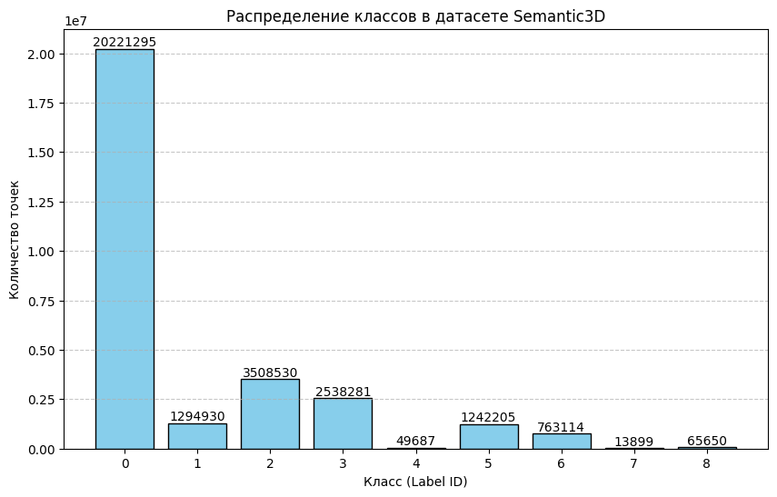

##Формирование данных для машинного обучения в формате NumPy на основе датасета Semantic3D

---

## 1. Цель работы

Научиться:
- Загружать облака точек из датасета Semantic3D;
- Формировать единый массив данных NumPy (таблицу), объединяющий признаки и метки классов;
- Выполнять базовую предобработку: нормализацию координат и признаков;
- Подготавливать данные для подачи в модели машинного обучения (например, PyTorch).

---

## 2. Задача

Используя один файл из датасета Semantic3D (`bildstein_station1_xyz_intensity_rgb.label`), сформировать единый массив данных `dataset`, где каждая строка соответствует одной точке, а столбцы представляют:

```
X Y Z R G B intensity label
```


---

**Основные этапы реализации:**

1. **Загрузка данных:**
   - Использованы файлы сцены `bildstein_station1_xyz_intensity_rgb.txt` (координаты и цвет) и соответствующий файл разметки (`.labels`).
   - Для оптимизации памяти использован тип данных `float32`.
   
2. **Валидация:**
   - Проверка соответствия количества строк в облаке точек и в файле меток.
   
3. **Feature Engineering и Нормализация:**
   - **Координаты (X, Y, Z):** Центрирование облака (Zero-mean centering) относительно среднего значения для устранения зависимости от глобальной системы координат сканера.
   - **Цвет (RGB):** Масштабирование каналов из диапазона `[0, 255]` в `[0, 1]`.
   - **Интенсивность:** Сохранена как дополнительный признак, нормализована в диапазон `[0, 1]`.
   
4. **Агрегация:**
   - Объединение всех признаков и метки в массив `dataset` размерности `(N, 8)`, где N — количество точек.
   - Структура: `[X, Y, Z, R, G, B, Intensity, Label]`.
   
5. **Экспорт:**
   - Сохранение массива в бинарном формате `.npy` (для быстрого I/O в Python), `.h5` (HDF5) и `.txt` (только первые 1000 точек для скорости).

6. **Визуализация:**
   - Построена гистограмма распределения классов для оценки баланса классов в выборке.

---


**Первые 5 строк итогового массива (`dataset`):**
```
X      Y      Z      R      G      B      Int   Label
[[ 0.142  0.285 -0.011  0.498  0.553  0.604  0.193  0.   ]
 [ 0.141  0.285 -0.013  0.51   0.553  0.624  0.217  0.   ]
 [ 0.14   0.285 -0.014  0.545  0.592  0.647  0.179  6.   ]
 [ 0.141  0.285 -0.014  0.514  0.576  0.639  0.169  0.   ]
 [ 0.141  0.285 -0.014  0.518  0.569  0.631  0.158  0.   ]]
```

- Данные успешно нормализованы: координаты центрированы около нуля, цветовые каналы приведены к диапазону `[0,1]`.

**Визуализация распределения классов:**  




---

## 5. Контрольные вопросы

1. **Определение датасета Semantic3D:**
Semantic3D — крупномасштабный датасет для семантической сегментации 3D-облаков точек, полученных методом наземного лазерного сканирования. Основные характеристики: высокая плотность (миллиарды точек), наличие атрибутов RGB и интенсивности, уличные сцены.

2. **Отличия от ImageNet и S3DIS:**
- От ImageNet: данные неструктурированные (xyz), не изображения.
- От S3DIS: S3DIS — indoor, RGB-D; Semantic3D — outdoor, LiDAR; отличается масштабом и плотностью точек.

3. **Состав и структура:**
- Training set: 15 сцен с разметкой.
- Test set: 15 сцен без открытой разметки.
- Цель разделения: проверка обобщения моделей на новых данных.

4. **Способ получения данных и влияние:**
- Terrestrial Laser Scanning (TLS).
- Проблемы: неравномерная плотность (близкие точки плотные, удаленные редкие), зоны теней за объектами.

5. **8 семантических классов:**
- Man-made terrain: дорога, тротуар.
- Natural terrain: трава, грунт.
- High vegetation: деревья (>2 м).
- Low vegetation: кустарники (<2 м).
- Buildings: здания, стены.
- Hard scape: остановки, скамейки, заборы.
- Scanning artifacts: шум, артефакты сканирования.
- Cars: автомобили.

6. **Проблемы разметки:**
- Граничные эффекты между объектами.
- Шум и артефакты сканирования.
- Сложность точной разметки больших сцен.

7. **Технические проблемы работы с объёмными облаками:**
- Ограничения памяти (RAM/VRAM).
- Требуется эффективная структура (Octree, KD-tree).
- Необходимость нарезки сцен (tiling/blocking).

8. **Неравномерная плотность точек:**
- Количество точек на единицу площади падает с удалением от сканера.
- Проблемы обучения: модели переобучаются на плотные участки, игнорируют редкие.

9. **Несбалансированность классов:**
- Классы "Здания", "Дорога" — доминируют; "Машины" — малочисленны.
- Влияет на метрики (Accuracy vs mIoU).
- Решение: взвешивание функции потерь.

10. **Этапы предобработки:**
- Геометрическая нормализация: центрирование координат.
- Даунсэмплинг (Voxel Grid).
- Нарезка сцены на блоки/сферы.
- Аугментация: повороты, масштабирование, добавление шума.

