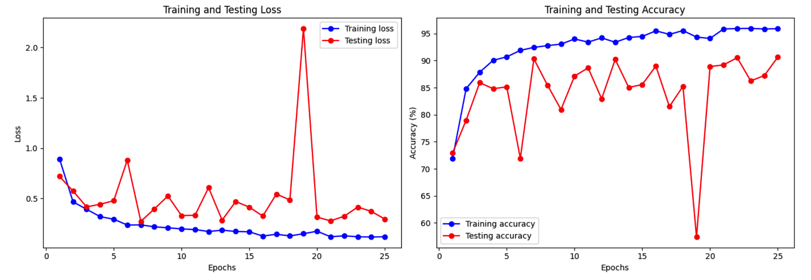
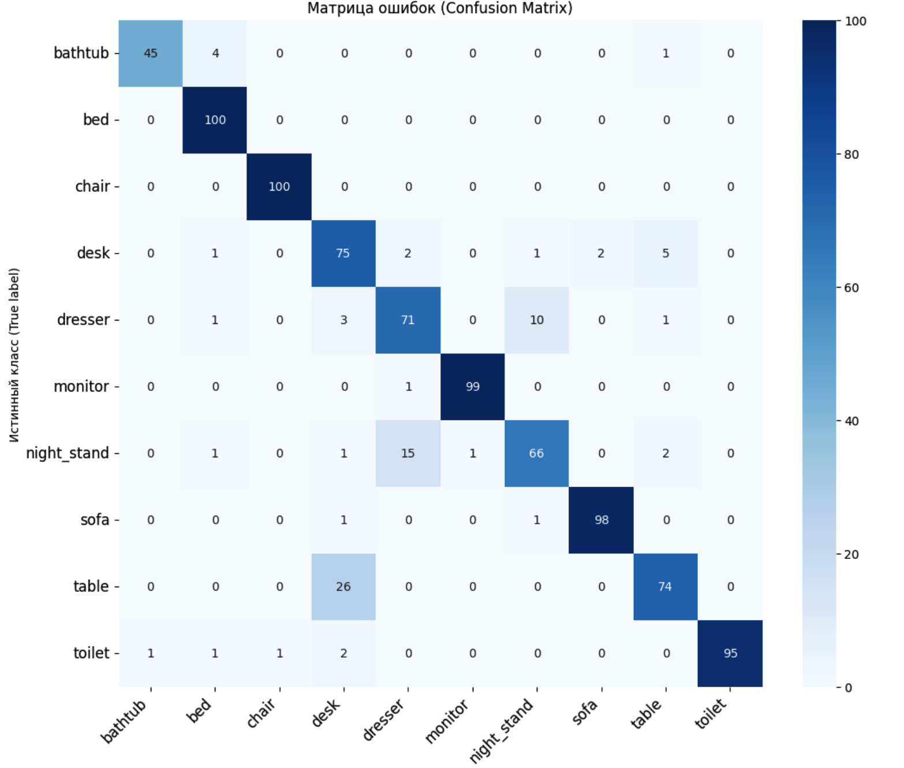

# Классификация 3D-объектов с использованием PointNet

m

### 1. Цель работы

Целью данной работы являлось изучение архитектуры PointNet для анализа неупорядоченных точечных данных, реализация нейросетевой модели для классификации 3D-объектов из датасета ModelNet10, а также обучение, тестирование и анализ качества полученной модели.

### 2. Ход работы

Работа была разделена на следующие этапы:

1.  **Подготовка данных:**
    *   Был использован датасет ModelNet10 в формате `.off`, содержащий 3D-модели 10 различных классов.
    *   Реализован кастомный загрузчик данных (`Dataset`) на PyTorch, который для каждой 3D-модели выполняет следующие операции "на лету":
        *   Чтение `.off` файла с помощью библиотеки `open3d`.
        *   Равномерное сэмплирование **1024 точек** с поверхности 3D-модели для формирования облака точек.
        *   Нормализация координат облака точек в диапазон `[-1, 1]` путем центрирования (вычитание среднего) и масштабирования (деление на максимальное расстояние от центра).

2.  **Архитектура модели:**
    *   Была реализована архитектура **PointNet** в соответствии с оригинальной статьей. Ключевые компоненты модели:
        *   **T-Net (Input Transform):** Две мини-сети для предсказания аффинных преобразований, выравнивающих входное облако точек (3x3) и его признаки (64x64) для достижения инвариантности к поворотам и сдвигам.
        *   **Shared MLP:** Набор одномерных сверточных слоев (`Conv1d`), применяемых к каждой точке независимо для извлечения признаков.
        *   **Max Pooling:** Операция симметричной агрегации, которая собирает глобальный вектор признаков, описывающий всю форму объекта, что обеспечивает инвариантность к порядку точек.
        *   **Классификатор:** Полносвязные слои (MLP) для финальной классификации на основе глобального вектора признаков.

3.  **Процесс обучения:**
    *   **Гиперпараметры:**
        *   Количество эпох: 25
        *   Размер батча: 32
        *   Оптимизатор: Adam с `learning_rate = 0.001`
    *   **Функция потерь:** `CrossEntropyLoss`, стандартная для задач многоклассовой классификации.
    *   **Метрика качества:** Точность (Accuracy).
    *   В ходе обучения сохранялась версия модели с **наилучшей точностью на тестовой выборке**.

### 3. Результаты и их анализ

#### 3.1. Итоговые метрики

Модель была успешно обучена в течение 25 эпох. **Наилучшая достигнутая точность на тестовой выборке составила 90.64%**. Этот результат свидетельствует о высокой эффективности архитектуры PointNet для задачи классификации облаков точек.

#### 3.2. Динамика обучения

Графики изменения функции потерь (Loss) и точности (Accuracy) наглядно демонстрируют особенности процесса обучения:

*   **Кривые обучения (синие):** Модель уверенно обучалась на тренировочных данных. `Training Loss` монотонно убывала, а `Training Accuracy` росла, достигнув ~96%. Это говорит о том, что модель имеет достаточную емкость для запоминания обучающей выборки.

*   **Кривые тестирования (красные):** Поведение модели на тестовых данных было нестабильным. `Testing Loss` и `Testing Accuracy` испытывали значительные колебания от эпохи к эпохе, с особенно заметными "провалами" (например, на эпохах 6 и 19). Такая нестабильность характерна для моделей, работающих с динамически сэмплируемыми данными, и может быть вызвана стохастической природой выборки точек или слишком высокой скоростью обучения.

*   **Переобучение (Overfitting):** Начиная примерно с 5-й эпохи, наблюдается расхождение между кривыми обучения и тестирования. Зазор между `Training Accuracy` и `Testing Accuracy` указывает на наличие переобучения — модель начала "подстраиваться" под особенности тренировочных данных в ущерб обобщающей способности. **Однако это является приемлемой ситуацией**, поскольку реализованный механизм сохранения только **лучшей** модели по тестовой метрике (аналог Early Stopping) позволяет получить на выходе не последнюю, а наиболее эффективную версию модели, минимизируя негативное влияние переобучения.

#### 3.3. Анализ ошибок по классам

Матрица ошибок позволяет детально проанализировать качество классификации для каждого класса:

*   **Хорошо распознаваемые классы:** Модель практически безошибочно определяет такие классы, как `bed` (кровать), `chair` (стул), `monitor` (монитор) и `sofa` (диван), где точность на диагонали близка к 100%.

*   **Основные ошибки классификации:** Наибольшее количество ошибок происходит между семантически и геометрически схожими объектами:
    *   **`table` (стол) ↔ `desk` (письменный стол):** Это самая частая ошибка. 26 объектов класса `table` были неверно определены как `desk`. Это логично, так как данные классы имеют очень схожую геометрию (плоская поверхность на ножках).
    *   **`dresser` (комод) ↔ `night_stand` (тумбочка):** Модель также часто путает эти два класса. Их формы (прямоугольные "коробки") очень похожи, и основное отличие заключается в масштабе, который является сложным признаком для извлечения.

#### 3.4. Визуальный анализ классификации

Помимо количественных метрик, был проведен качественный анализ результатов путем визуализации предсказаний модели на нескольких примерах из тестовой выборки. На рисунке выше представлены облака точек для объектов классов `bathtub` и `bed`.

Зеленый цвет заголовка (`True: ... | Pred: ...`) указывает на то, что предсказание модели совпало с истинной меткой. Как видно из представленных примеров, модель **уверенно и корректно** классифицировала все показанные объекты. Это визуально подтверждает высокую точность, полученную в ходе тестирования, и демонстрирует, что модель научилась улавливать характерные геометрические особенности каждого класса. Данный метод также является эффективным инструментом для анализа ошибок, позволяя в случае неверной классификации (красный заголовок) понять ее возможные причины.

### 4. Ответы на контрольные вопросы

1.  **Какие категории объектов классифицируются хуже всего и почему?**
    Хуже всего классифицируются `table` (из-за путаницы с `desk`) и пары `dresser` / `night_stand`. Причина кроется в высокой межклассовой схожести (объекты разных классов выглядят похоже) и высокой внутриклассовой вариативности (объекты одного класса могут сильно отличаться друг от друга).

2.  **Влияет ли количество точек (512, 1024, 2048) на качество модели?**
    Да, напрямую. **Больше точек (2048)** позволяет точнее аппроксимировать поверхность объекта, что может улучшить качество распознавания мелких деталей и повысить точность. Однако это увеличивает вычислительные затраты и чувствительность к шуму. **Меньше точек (512)** ускоряет обучение, но может привести к потере важной геометрической информации и снижению точности. 1024 точки является общепринятым компромиссом.

3.  **Какие преимущества PointNet по сравнению с CNN для 3D данных?**
    PointNet имеет три ключевых преимущества перед классическими CNN:
    *   **Инвариантность к порядку точек:** PointNet обрабатывает облако точек как неупорядоченное множество. Благодаря симметричной функции (max-pooling), результат не зависит от того, в каком порядке подаются точки. CNN же требуют структурированных данных в виде сетки (grid), как на изображениях.
    *   **Прямая обработка данных:** PointNet работает непосредственно с облаками точек, избегая затратной и ведущей к потере информации вокселизации (преобразования в 3D-сетку), которая необходима для 3D CNN.
    *   **Инвариантность к преобразованиям:** За счет использования модулей T-Net модель учится канонически выравнивать объекты перед извлечением признаков, что делает ее более устойчивой к поворотам и сдвигам.

### 5. Заключение

В ходе работы была успешно реализована и обучена нейросетевая модель на архитектуре PointNet для задачи классификации 3D-объектов. Достигнута высокая точность в **90.64%** на датасете ModelNet10. Анализ результатов показал, что модель эффективно извлекает геометрические признаки из облаков точек, а ее ошибки являются логичными и связаны со схожестью классов. Работа подтвердила эффективность PointNet для анализа неупорядоченных 3D-данных.